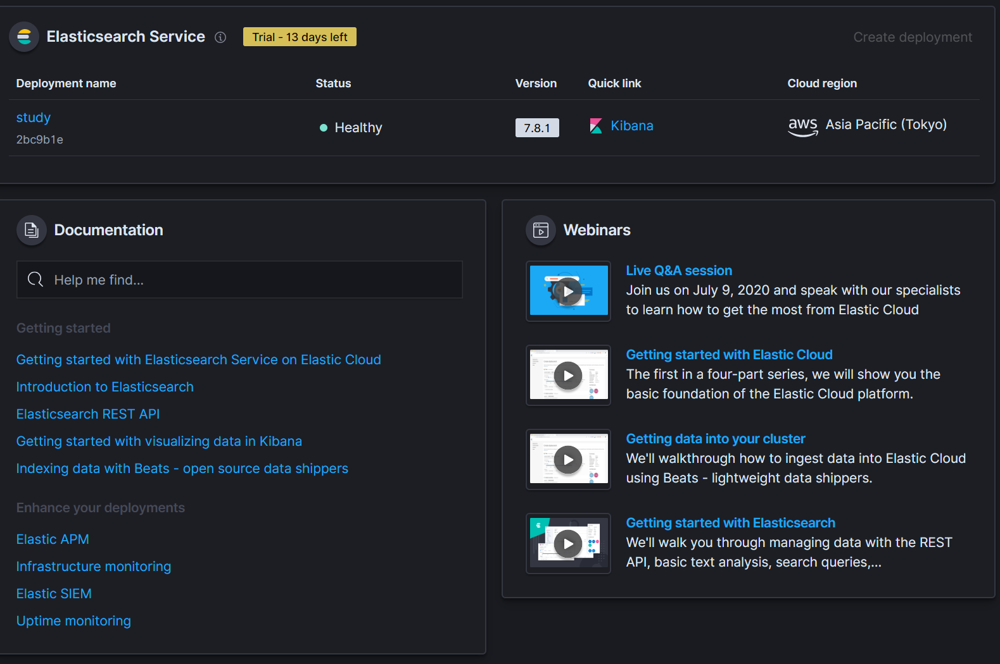
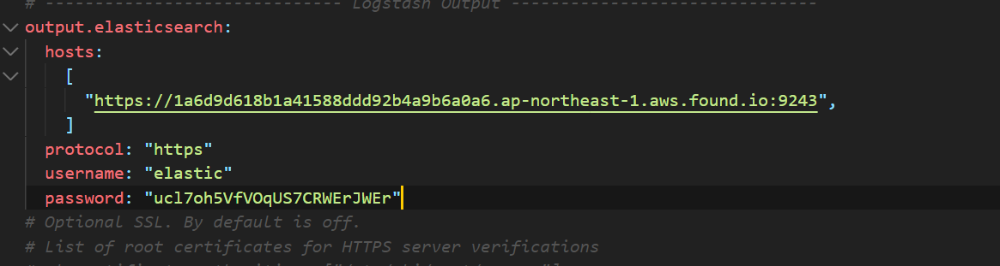
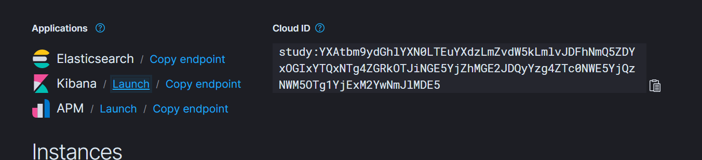
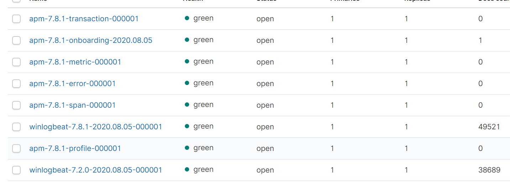

# 엘라스틱 클라우드 환경으로 여러 클라이언트 로그 받아보기

[링크](https://www.elastic.co/kr/cloud/) 로 이동해 엘라스틱공식 홈페이지 가입 후 체험판 시작 누르기

이때 만들어지는 패스워드와 아이디는 한번밖에 안나옴으로 **꼭 저장할것**!

## 만들어보기

1. 다음과 같이 엘라스틱 클라우드를 만들어준다.



2. winlogbeat의 설정을 바꾼다.





이때 hosts는 ElasticSearch Endpoint 주소이고

username은 첨에 확인햇던 아읻
password는 첨에 확인했던 비밀번호이다.

그이후 파워쉘에서

winlogbeat를 설정파일을 적용시킨후에 실행시킨다.

```
./winlogbeat.exe -c ./winlogbeat.yml -e
```

그러고 나서 winlogbeat가 제대로 들어가는지 확인한다.



winlogbeat를 확인하고 인덱스 패턴을 정의한 후에 분석한다!

이렇게 설정하면 저 yml파일 가지고 있는 winlogbeat는 같은 elasticsearch로 전송이 된다!
