# windlogbeat 개요

**새로운 이벤트가 적시에 전송되도록 이벤트 로그 감시하는 역활**

winlogbeat는 ElasticBeat이기 때문에 만약 자료가 안나온다면 ElasticBeat를 참고해도 좋을듯

## 시작하기 전에

> 사전 설치 제품 
> Kibana, Elasticsearch, Logstash(선택사항)

## 설치법 - 유섭이 자료 참고해서 실습함

1. [링크](https://artifacts.elastic.co/downloads/beats/winlogbeat/winlogbeat-7.8.1-windows-x86_64.zip) 버튼을 눌러 winlogbeat window ver 64bit 다운로드!

2. C드라이브 최상위에 압축풀기

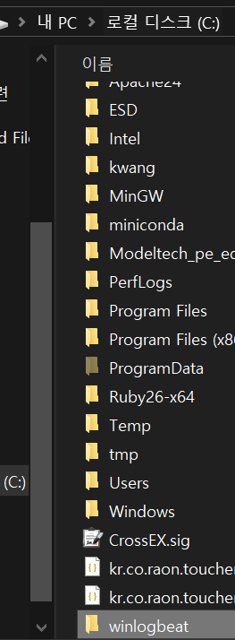

3. 구성요소(winlogbeat.yml)확인하기!

구성요소 문법은 [여기](https://www.elastic.co/guide/en/beats/libbeat/7.8/config-file-format.html) 를 참조할 것.

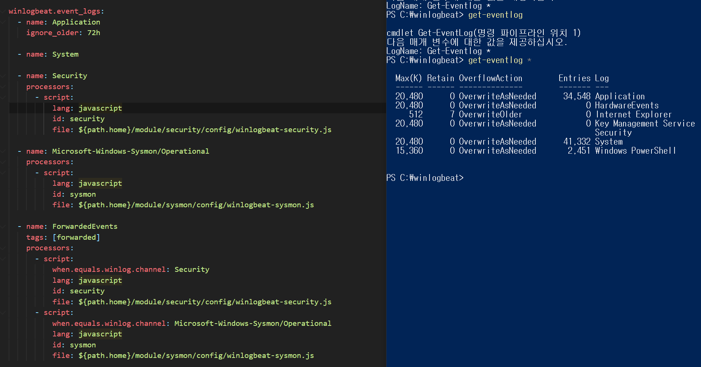
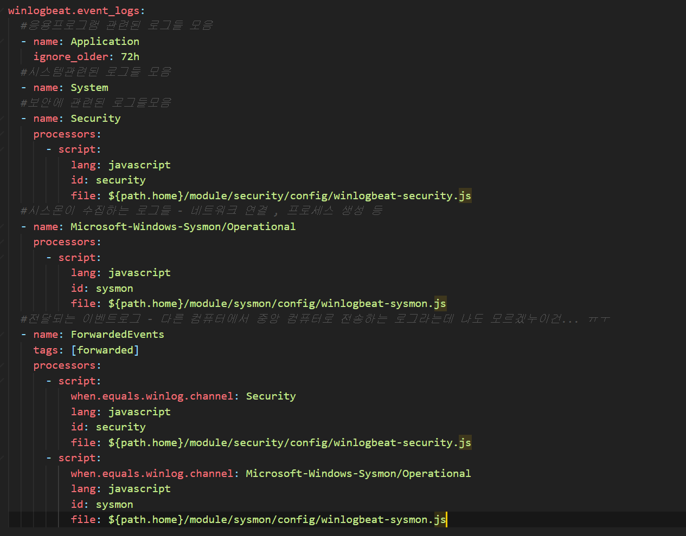

Name:부분엔 powershell로 얻을수 있는 eventlog 항목을 적으면 여기 설정에서 보면 전부다 가져오는 것을 알 수 있음

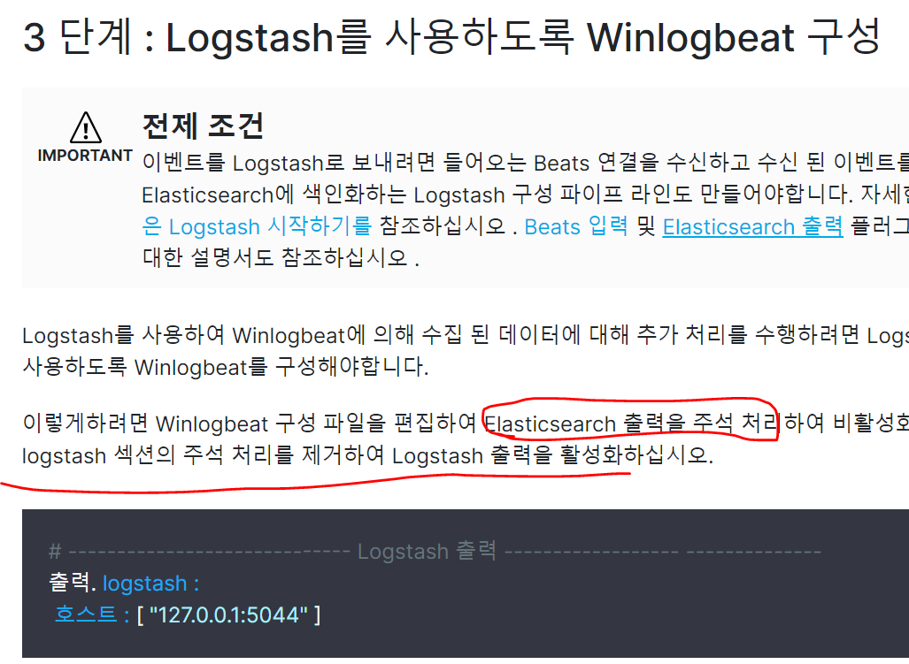

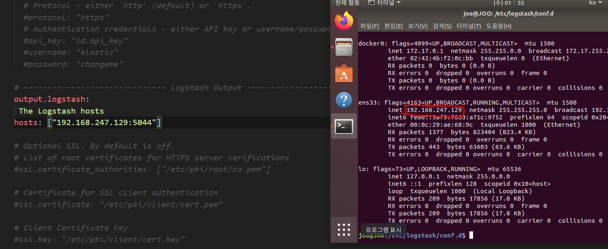

4. 설치

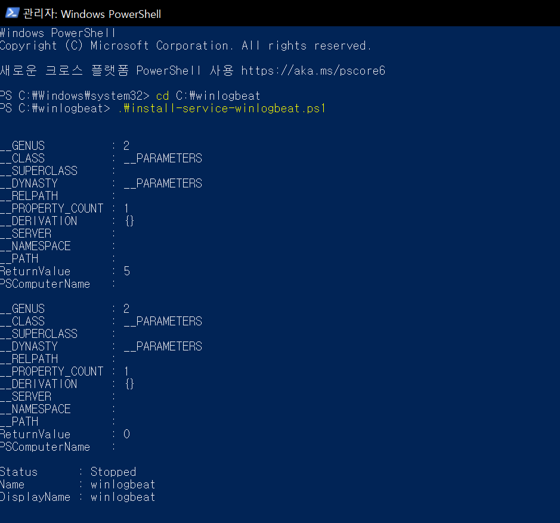

5. 구성요소 설정

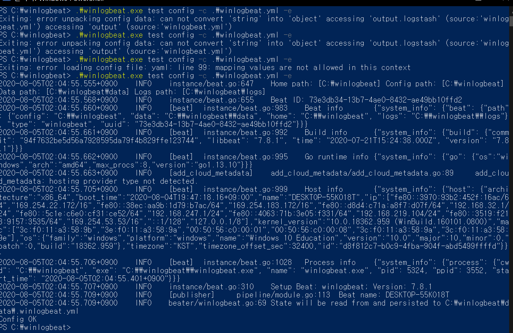

6. winlogbeat 시작

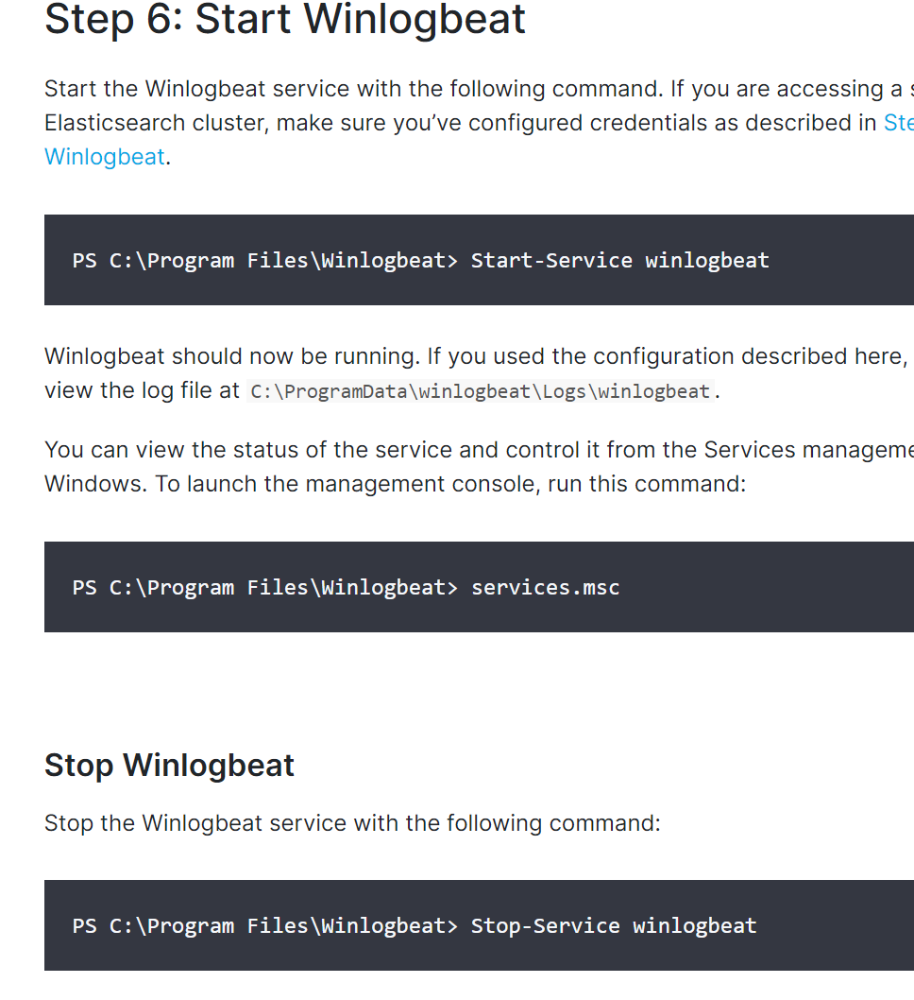

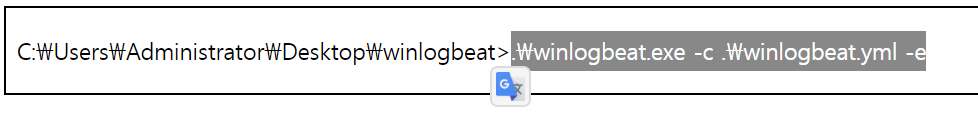

설정파일 변경은 이걸로 해야됨  -유섭이가 참고한 사이트 하니까 바로됨

원래는 뭐 로그 전송 이런거 안떳엇는데 아마 설정파일 적용해서 실행하는건 이것인듯... ㅠㅜ

7. 확인

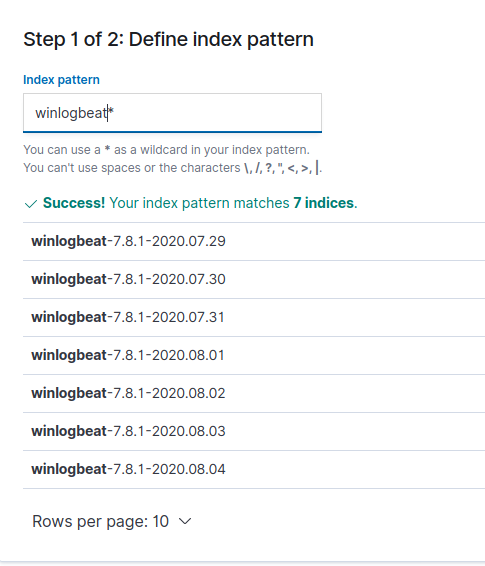

키바나로 확인한 결과 로그가 올라옴! 인덱스 패턴 정의중

8. 과제

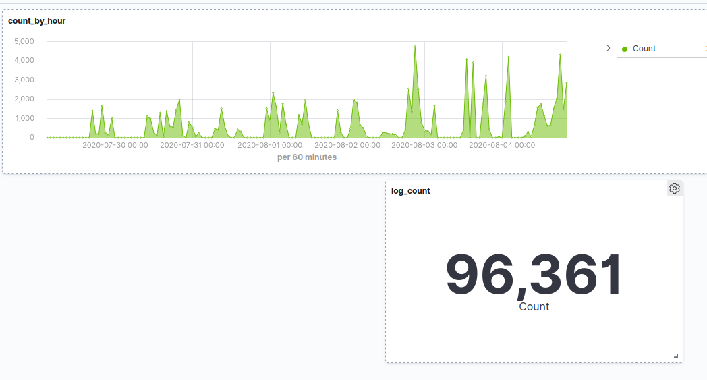

보면 카운터가 줄어든 구간은 컴퓨터를 자주 사용안하는 새벽시간대나 밖에서 활동하는 낮시간대 에 분포하고 있다 얼추 내가 컴퓨터 썼던 시간이랑 맞았다.

-> 데이터의 신뢰성은 대략적으로 파악했음

## 실습하면서 느낀점

유섭이랑 다른점은 나는 필터링을 안거쳤기때문에 모든로그를 다 긁어왔다 -> 9만개의 로그가 쌓임. -> 쓸데없는 용량차지 필터링 방법도 연구해야하는것이 숙제

문제는 현재 시각 08.05일 03시인데 이것에 대한 인덱스가 안올라왔다.. 그 이유를 찾아야할 것 같다.. -> 실시간이라고 믿어도되는건지..?