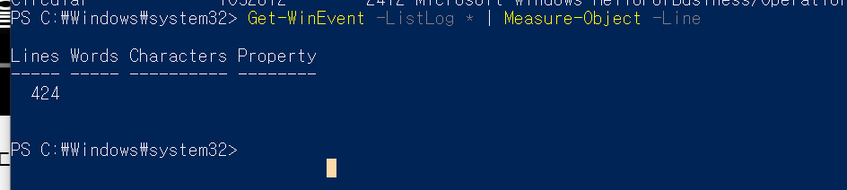
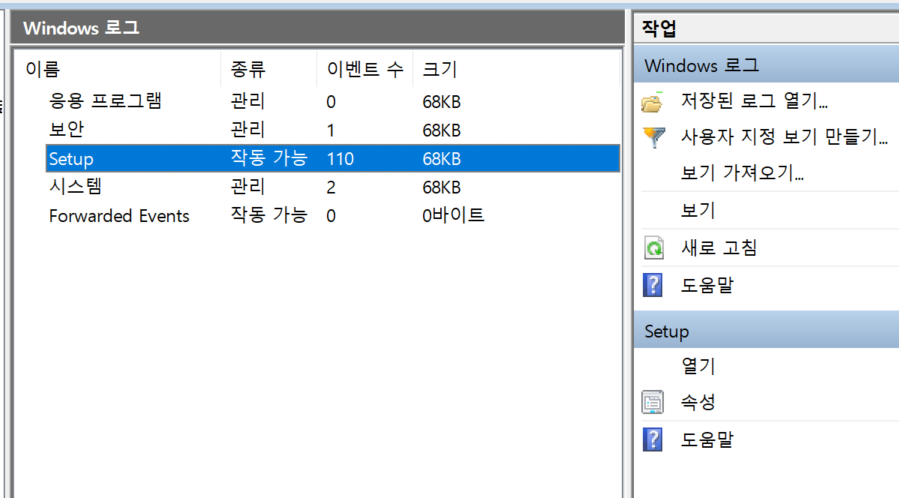
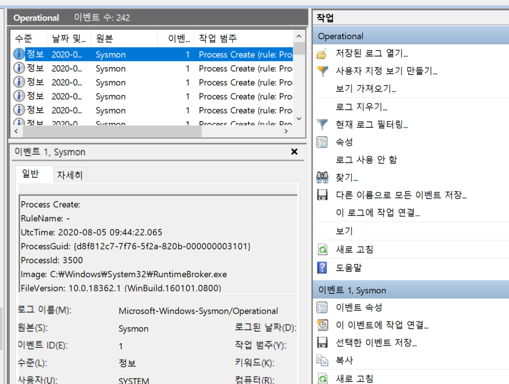
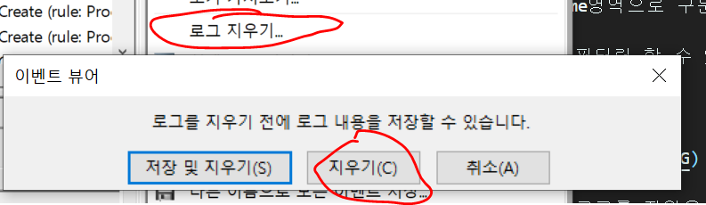
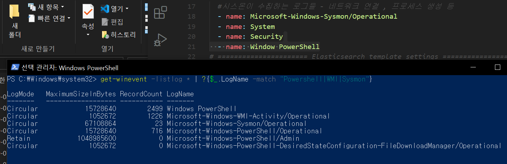

# 이벤트로그와 winlogbeat

본 내용은 [링크](https://www.youtube.com/watch?v=MQ1b5eyQgxE) 를 참고하여 정리하였습니다.

## 이벤트 뷰어

powershell에서 어떤 로그들이 있는지 리스트를 볼 수 있음 

총 424개의 로그 항목이 있다.

yml파일에 설정해주면 자동으로 데이터가 넘어가 필터링이 됨.

yml로 name영역으로 구분해준 것은 winlog.channel 에 정보가 표시됨

이것으로 필터링 할 수 있음.

그 전에

쌓여있던 로그를 지웠음!

### 지우고 새롭게 분석을 해보자 - 쌓인 로그는 너무 많다

지우길 원하는 로그부분에 들어가서

이렇게 지우면 깔끔히 지워짐 그리고나서

winlogbeat에서 받아올 로그들을 저렇게 설정을 하고 kibana로 확인해봣다

방금 한 행동에 대해서 바로 확인할 수 있어서 분석이 조금 편했음 물론 필터링 없이 들어오기 때문에 순식간에 100몇개가 sysmon을 통해 로그를 받아오기 때문에 system로그확인해서 인증여부, 컴퓨터 로그인여부 이런거 확인할 수 있음
