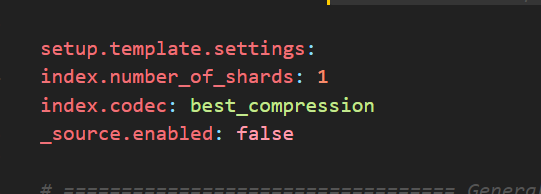
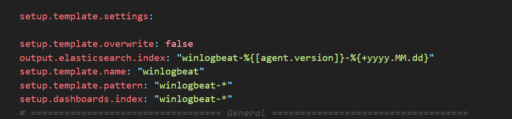
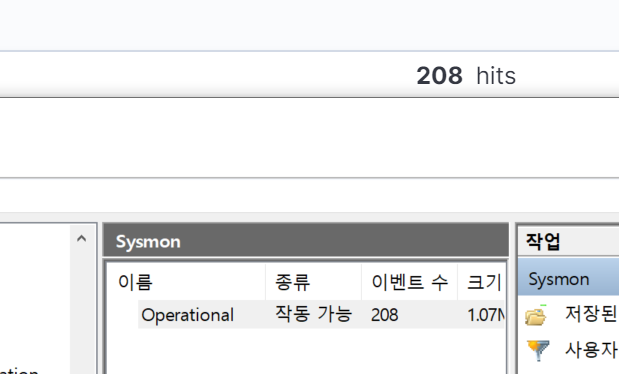
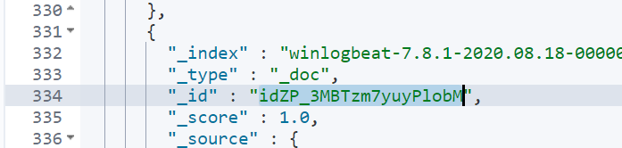

# PC 1대의 활동영역을 시각화 하기.

## 자동으로 인덱스 패턴 정의해주는 설정 실험

### 개요

> 유섭이가 넣은 데이터는 자동으로 인덱스패턴 정의해주는데... 설정차이가 있나?

yml차이를 보니



요부분이 추가가 되어잇는 것 같아서 적어보고 실험을 진행할 예정이다 그전에

template가 뭔지 검색을 해보았다.

[링크](https://www.elastic.co/guide/en/beats/metricbeat/current/metricbeat-template.html) 를 보니 거의 확신을 하였고 글을 참고하고

다음과 같이 내 입맛 대로 설정을 진행해봤다.



자동으로 들어가긴했지만.. 필터링이 제대로 안된다.

```yml
winlogbeat.event_logs:
  #시스몬이 수집하는 로그들 - 네트워크 연결 , 프로세스 생성 등
  - name: Microsoft-Windows-Sysmon/Operational
  - name: System
```

현재 설정된 필터링 정보

그러나 Security가 계속 들어온다. 원인을 찾는중.. -인덱스 자동 정의는 성공했다.

깨달음! - 항상 설정을 바꾸고 시작할 땐 data에 있는 .winlogbeat.yml을 지워줘야된다. 그래야 예측한 데이터가 제대로 들어감



예측한대로 이벤트 뷰어에 있는 내용이 그대로 들어가는 것을 확인했슴!

## 인덱스 패턴을 자동으로 정의해주는 설정 찾아보기!

> 목표: 인덱스패턴과 인덱스를 내가 원하는 이름으로 자동으로 추가하기 ex) winlogbeat-JOO-2020.08.18 이런느낌!

인덱스 패턴을 정의해보자!

일단 이것에 대해서 yml파일에 template부분이 그것을 설정하는 개념같음 그래서 그것을 검색하고 찾은 [링크](https://oboki.net/workspace/bigdata/elasticsearch/elasticsearch-index-template/) 보고 공부했음!

```
먼저 용어정리가 잘안되어 있어서 복습했다.

Cluster - 가장 큰 시스템 단위 (간단하게 하나의 elasticsearch자체라고 생각하면 될까나..) 검색 인덱싱 등 기능을 제공 기본 이름은 'elasticsearch'라고함!
Node - 클러스터 안의 단일 서버라고 생각하면됨 따라서 cluster기능(검색 인덱싱 등)에 참여하고 자동으로 elasticsearch라는 클러스터에 기본으로 가입하도록 설정됨

------------위는 물리적 구조를 나타냄--------------
Index- 유사한 데이터들을 담은 그릇 shard라는 것을 두어 데이터를 복제해서 저장하거나 초과할경우 다른 샤드에 저장함.
type - 그하위
document - 데이터베이스로 치면 row에 해당하는 값 즉 값 하나하나 를 document라고함!
--------엘라스틱서치가 가지는 데이터 계층 논리적 구조-----------
```

그래서 알 수 있었던 것이

Index는 winlogbeat-7.8.1.날짜-~~
이렇게 들어가는 방면에 type은 \_doc으로 들어가는 것을 확인했음
id값은 암호화된 고유한 문자들이 들어감



일단 [링크](http://kangmyounghun.blogspot.com/2019/05/beat.html)에 따라서 설정을 해보았다.

흠... logstash를 거치는게 아니면 불가능이라 판단...

일단은 하나의 인덱스 패턴에서 각사용자로 필터링한 화면을 출력해주는 것을 목표로 해보자 - 효율성은 나중에 따져보고

