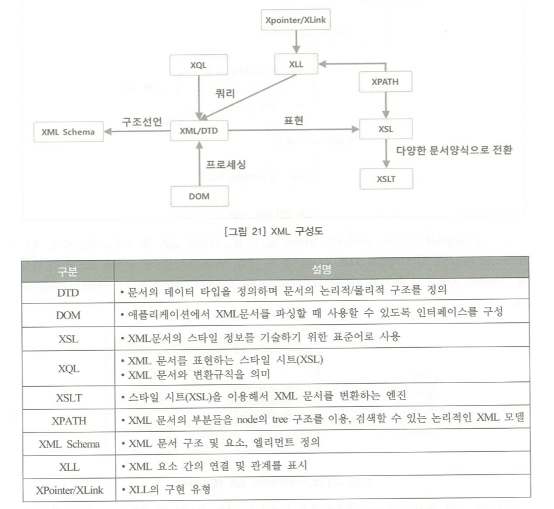

# chapter1. HTTP 동작원리

## 개요

웹의 구성요소 3개 - HTTP, HTML, URL 개발

### HTML

html파일을 웹브라우저에서 로딩하면 웹 페이지를 확인 가능

### HTTP

웹 서버와 클라이언트간에 데이터를 교환하기 위한 통신 규약. Request와 Response 프로토콜로 표현 가능. 특징은 3가지와 같다.

- 비연결지향
- 상태정보 유지안함
- 쿠키와 세션을 사용 => 클라이언트에 저장되는 키와 값들의 작은 데이터 조각.

> 쿠키가 생기는 원리<br>클라이언트가 브라우저에 접속하면 요청한 웹페이지 처리후 쿠키를 저장.

쿠키 저장 위치는 다음과 같다.

```
C:\User\사용자명\AppData\Local\Microsoft\Windows\INetCache
```

세션은 서버의 메모리에 저장되는 정보임.

```
1. 클라이언트가 웹서버에 로그인시도
2. 로그인이 되면 서버 메모리에 세션 ID를 생성하고 클라이언트의 ID와 맵핑정보저장
3. 클라이언트 세션ID를 쿠키로 저장
4. 클라이언트는 요청마다 서버는 쿠키정보확인해 세션ID와 매핑되는 ID를 사용자로 인증.
```

### 히든필드

form 태그의 GET POST 메서드를 통해 데이터를 전달함. 이때 로그인에 대한 인증 값을 유지할 수 있다.

## HTTP 메세지

### 요청 메세지

메세지는 크게 1. request line 2. request header, 3. message body

1. requset line

목적이나 종류를 알수 있는 부분 구조는

POST(메서드) /~(request URI)/http(HTTP버전)

2. request header

| 구분            | 내용                                                      |
| --------------- | --------------------------------------------------------- |
| Host            | 클라이언트가 요청한 서버 정보 - ip주소                    |
| User-Agent      | 클라이언트 브라우저의 이름, 버전                          |
| Accept          | 클라이언트가 허용할 수 있는 파일 형식                     |
| Referrer        | 현재 페이지가 어떤 웹 페이지에서 요청되었는지에 대한 정보 |
| Accept-Encoding | 클라이언트가 인식할 수 있는 인코딩 형식                   |
| Accept-Language | 클라이언트가 인식할 수 있는 언어                          |

3. Message Body

실제 데이터를 넣는 영역

### 응답 메세지

1. status Line

HTTP버전 상태코드 이유 구문(OK)

ex) 200 제대로 처리 202 요청 접수 그러나 처리되지 않음 400 잘못된 요청 403 금지된 요청

2. Response Header

추가적인 정보 전달.

Accept-Ranges 단위 범위 설정

ETag: 동일하게 요청된 자원으로부터 2개이상의 엔티티들을 비교.

예를 들어 동일 URL재요청을 할 경우 Etag값을 같이 보내게되는데, 이때 동이랗면 기존데이터가 변동없음을 알리는 304코드를 반환하지만 동일하지 않으면 전체 응답을 전송함.

추가적인 정보를 전달하는 필드는 다음과 같다.

| 구분               | 내용                                                                        |
| ------------------ | --------------------------------------------------------------------------- |
| Accept-Ranges      | 서버가 자원에 대한 범위 요청을 수락함                                       |
| Age                | 발신자의 서버에서 응답이 생성된 이후 발신자의 예상시간을 전달               |
| ETag               | 요청된 변화에 대해 Entity 태그의 현재 값을 제공                             |
| Location           | 목적지                                                                      |
| Proxy-Authenticate | 407 코드의 응답의 일부로 표함됨.                                            |
| Retry-After        | 503코드와 함께 사용되고 서비스를 사용할 수 없는 예상시간을 나타냄           |
| Server             | 사용 중인 웹서버 정보를 제공                                                |
| Vary               | 캐시 재검증 없이 후속요청에 응답하기 위해 응답을 사용할 수 있는지 여부 결정 |

### HTTP 관련 언어 기술

1. 자바스크립트
2. CSS
3. XML

XML은 정보를 태그로 표현. 구조는 다음과 같이 되어있음



4. HTML5 
5. php
6. ASP - window server용으로 설치하면 사용하는 server언어인듯 존나어려워서 패스
7. JSP -java기반으로 만든 서버언어

## 웹 서버 /WAS/DB의 이해

서버는 사용자가 데이터 요청했을때 데이터를 처리하고 HTML형태로 응답해주는 역활.

웹 서버 사이드의 언어엔 대표적으로 PHP,HSP,ASP와 같은 서버사이드 언어 제공.

그리고 그 언어를 지원하도록 도와주는 apache,nginx,java,IIS등 웹 에플리케이션이 필요하다.

그리고 동적 페이지에 대한 필요가 많아지자 서버와 사용자간의 데이터 조회/처리를 가능하게하는 Common Gateway Interface(CGI)가 나오게 되었다.

그러나 CGI는 요청건수에 따라 프로세스 갯수가 늘어나기 때문에 단점이 있고 이것을 극복하기 위한것이

WAS 가 나오게 되었다. WAS과 웹 서버를 구문하는 것은 두개가 목적이 다르기 때문. WAS는 동적인 데이터를 처리하도록 기능을 분배. 즉 웹 어플리케이션과 관련된 기능을 수행한다.

그러나 웹 서버는 클라이언트와 직접 연관된 일을 처리함.

