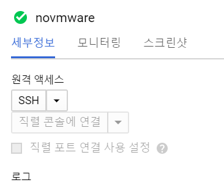
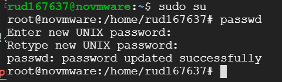
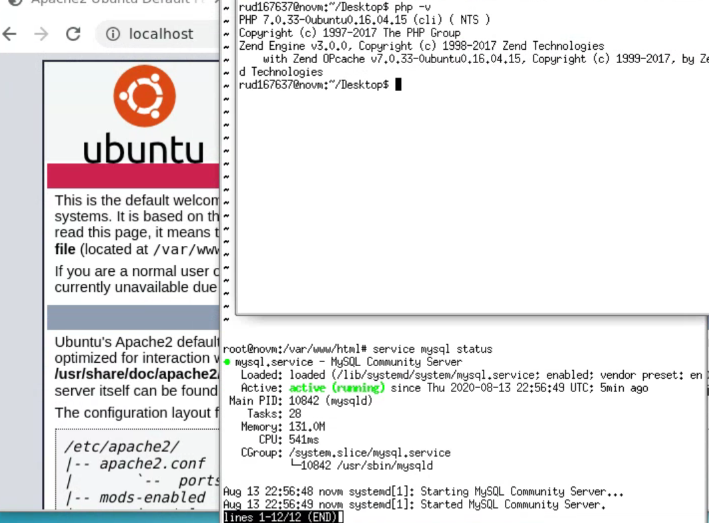
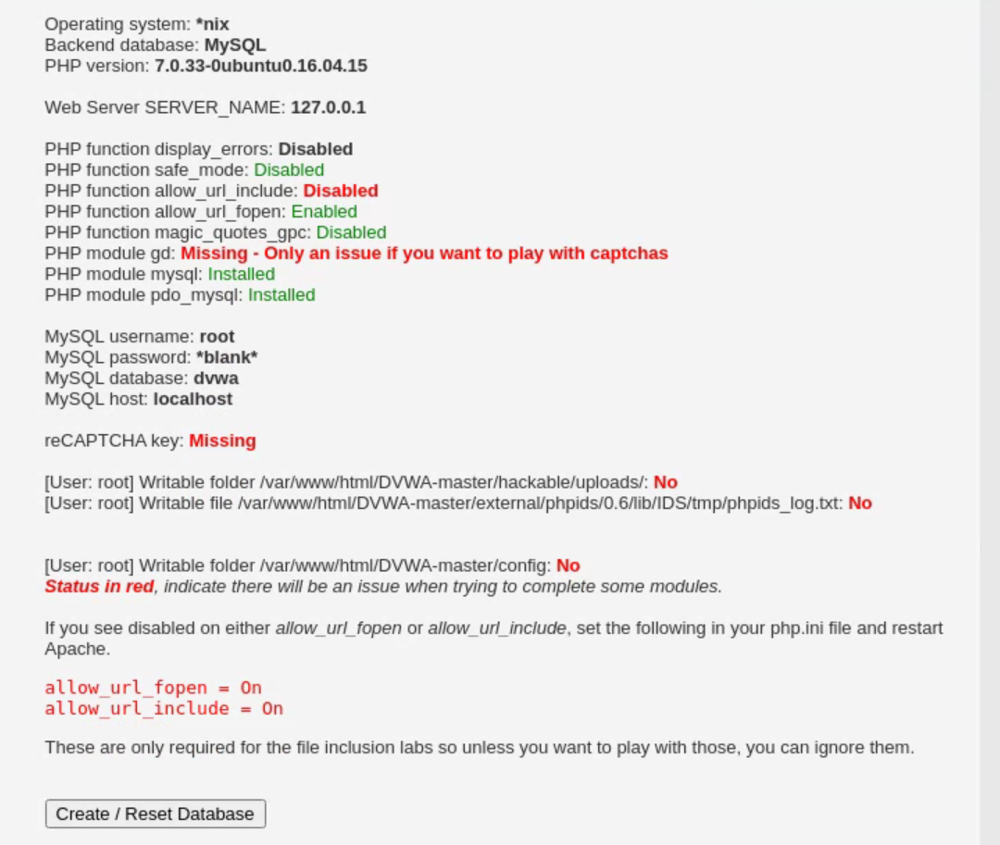
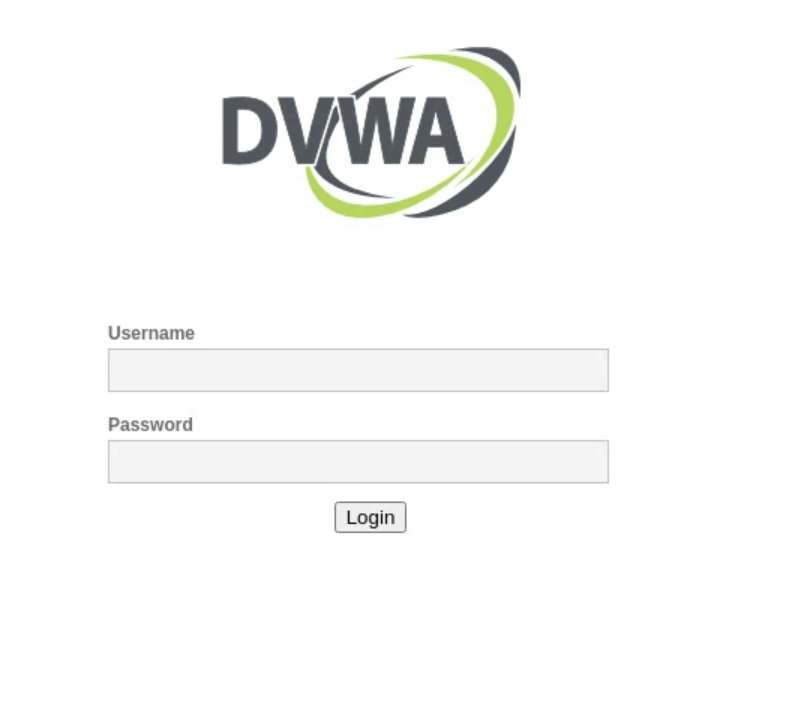
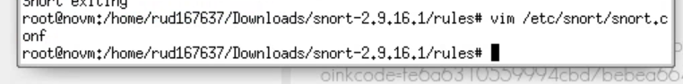
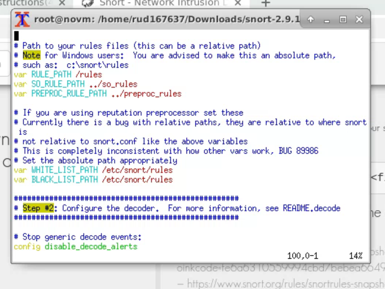
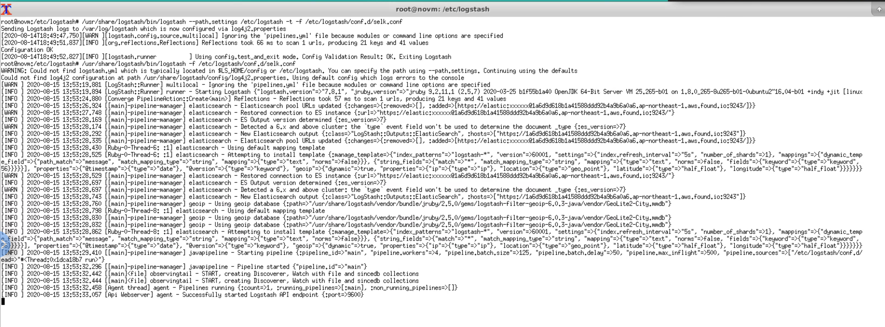
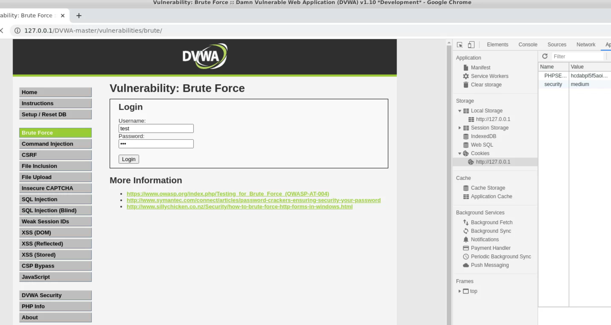

# 환경 구성

## 구성 개념

각자가 알아서 환경 설정하면되고 우분투를 쓰는게 사실 맞는지는 모르겠지만 일단 시도해보는 걸로 해봄.


다음과 같이 클라우드 컴퓨팅 설정



ssh버튼으로 접속

패스워드 설정후



그 다음

```
wget https://dl.google.com/linux/direct/chrome-remote-desktop_current_amd64.deb

sudo apt update

sudo apt install --assume-yes \
    ./chrome-remote-desktop_current_amd64.deb \
    chrome-remote-desktop

sudo DEBIAN_FRONTEND=noninteractive \
    apt install --assume-yes xfce4 desktop-base


echo "xfce4-session" > ~/.chrome-remote-desktop-session

sudo apt install --assume-yes xscreensaver

sudo apt install --assume-yes task-xfce-desktop

sudo systemctl disable lightdm.service

wget https://dl.google.com/linux/direct/google-chrome-stable_current_amd64.deb

sudo apt install --assume-yes  google-chrome-stable \
    ./google-chrome-stable_current_amd64.deb
```

```
https://remotedesktop.google.com/headless 로접속
```


이화면에서 데비안 리눅스 명령어 복사

그후 리눅스에서 생성할 비밀번호 입력후 완료!

[유튜브 영상](https://www.youtube.com/watch?v=KvaBoVcIyMU)

이거보고 따라했음!

그리고나서 터미널에서 su root로 루트권한 줄수잇음 미리 설정해놓은 패스워드 입력하면 됨

APM 설치는

[링크](https://webnautes.tistory.com/1028) 보고 따라함

참고로 httpd는 우분투에서는 apache2 임!

잘 설치됬는지 확인하는 것은 localhost 주소로 접속확인 -apache 정상 설치 완료

service mysql status 뭐 뜨면 정상 설치완료

php -v 뭐 뜨면 정상!



위의 캡쳐와 같이 확인 완료!!



그리고 책에 있는 내용과 같이 dvwa 가 뜨는 것을 확인했슴

그리고 첫번째 php.ini파일 수정하는 경로는 저 설치법대로하면 /etc/php/7.0/apache2/php.ini 인것을 확인함

그리고 apache service 재시작은 systemlctl restart apache2.service 명령으로 처리가능!



책대로 진행해서 셋팅완료 나는 여기서 mysql깔때 root하고 passwd를 입력해서 책에서 비워둔 패스워드를 나는 입력한 패스워드를 넣었음

## Snor 설치

먼저 기본패키지 설치하는 명령어는 apt install -y bison flex libcap* libpcap libglib2.0-dev gcc pcre*로 설치했다.

또한

```
apt install autotools-dev
apt install automake
apt install libssl-dev
```

여기서

snort의 관한 make make install 과정에서

Luajit 이라는 에러가 떳고 이것을 [링크](http://luajit.org/download.html) 에서 stable version을 받아

make && make install 명령으로 설치한뒤 해결했다. 그다음에

```
snort -V
```

명령을 입력했을때 오류가 뜬다면

```
cp /usr/local/lib/libdnet.1.0.1 /usr/local/lib/libdnet.so.1.0.1
/sbin/ldconfig
```

이것으로 해결했다.

그다음 책으로 한뒤에 snort -T -c /etc/snort/snort.conf에서 오류나서




다음과 같이 path를 바꿔주니 해결이 되었다.

그리고 엘라스틱 서치는 엘라스틱 클라우드로 진행해보려고 한다.

## logstash

그리고 현제 이 우분투에서는 logstash만 설치를 한다.

[링크](https://www.elastic.co/guide/en/logstash/7.8/installing-logstash.html#_apt)

apt 설치방법을 따라함 자바와 관련된 오류가 뜨면

[링크](https://www.digitalocean.com/community/tutorials/how-to-install-java-with-apt-on-ubuntu-18-04)

그리고 실행하는 명령어는 systemctl start logstash

그리고 설정파일 logstash.yml파일은 다음과 같이 정의했다.

```yml
input{
file{
path => "/var/log/snort/alert"
type => "snort_tcp"
start_position => beginning
ignore_older => 0
sincedb_path => "/dev/null"
}
file{
path => "/var/log/apache2/access.log"
type => "access_log"
start_position => beginning
ignore_older => 0
sincedb_path => "/dev/null"
}
}

filter{
if[type] == "snort_tcp" {
grok{
add_tag => ["IDS"]
match => ["message","{%SNORTIME:snort_time}\s+\[\*\*\]\s+\[%{INT:ids_gid}\:%{INT:ids_sid}\:%{INT:ids_rev}\]\s+\[%{DATA:Attk_Category}\]\s+\[%{DATA:Attk_Level}\]\s+%{DATA:Attk_Name}\s+\[\*\*\]\s+\[Classification:\s+%{DATA:ids_classification}\]\s+\[Priority:\s+%{INT:priority}\]\s+\{%{WORD:ids_proto}\}\s+%{IP:src_ip}\:%{INT:src_port}\s+\-\>\s+%{IP:dst_ip}\:%{INT:dst_port}"]
}
}
date {
match => [ "snort_time", "MM/dd-HH:mm:ss.SSSSSS"]
}
geoip{
source => "src_ip"
target => "geoip_snort_src"
}
geoip {
source => "dst_ip"
target => "geoip_snort_dst"
}
if [priority] == "1" {
mutate { add_field => { "severity" => "High & Medium & Low" }}
}
if [priority] == "2" {
mutate { add_field => { "severity" => "High & Medium"}}
}
if [priority] == "3" {
mutate { add_field => { "severity" => "High & Low"}}
}
if [priority] == "4" {
mutate { add_field => { "severity" => "Medium & Low"}}
}
if [priority] == "5" {
mutate { add_field => { "severity" => "High"}}
}
if [priority] == "6" {
mutate { add_field => { "severity" => "Medium"}}
}
if [priority] == "7" {
mutate { add_field => { "severity" => "Low"}}
}
if [priority] == "8" {
mutate { add_field => { "severity" => "ETC"}}
}
}

filter{
if [type] == "access_log" {
grok{
add_tag => ["apache2"]
match => ["message","%{IPORHOST:clientip} %{USER:ident} %{USER:auth} \[%{HTTPDATE:timestamp}\] \"(?:%{WORD:verb} %{NOTSPACE:request}(?:HTTP/%{NUMBER:httpversion})?|%{DATA:rawrequest})\" %{NUMBER:response} (?:%{NUMBER:bytes}|-) %{QS:referrer} %{QS:agent}"]
}
date{
match => ["timestamp","dd/MMM/YYYY/:HH:mm:ss Z"]
}
mutate {
convert => { "bytes" => "integer" }
}
geoip {
source => "clientip"
}
mutate {
convert => { "response" => "integer"}
}
}
}
output{
if [type] == "snort_tcp" {
elasticsearch {
hosts => ["https://1a6d9d618b1a41588ddd92b4a9b6a0a6.ap-northeast-1.aws.found.io:9243"]
user => "elastic"
password => "ucl7oh5VfVOqUS7CRWErJWEr"
index => "logstash-snort"
}
}
if [type] == "access_log" {
elasticsearch {
hosts => ["https://1a6d9d618b1a41588ddd92b4a9b6a0a6.ap-northeast-1.aws.found.io:9243"]
user => "elastic"
password => "ucl7oh5VfVOqUS7CRWErJWEr"
index => "logstash-apache"
}
}
}
```

~~첨에 그 오타를 못잡아서 이것도 존나 해결하다가 결국 에 잡음 씹 하루 이상날림~~

씹 첨엔 로그 아무것도 안들어가서 자고 일어나서 다시 확인하니까 들어가있음! 아마 첨엔 로그가 없어서 그런건가..?
쨋든 시간 지나니까 들어와있으니 설정 완료됨!!



phpstrom 설치 이후에 실습을 시작해 보자!!!

> 삽질하면서 얻은 결과: logstash필터가 어떻게 돌아가고 대충 똑같이 입력하면서 뭔가 감이옴....

## php7버전

똑같이 첨에 apt remove php\*로 기존 설치된 php를 지움

그다음 [링크](https://extrememanual.net/31049)에 들어가서 나와있는대로 설치함!

그리고 맨마지막에 설치할 때 터미널에 gui로 뭐가 뜨면 걍 엔터 누름

## xdebug

```
https://xdebug.org/wizard
```

링크 주소로 들어가 책에 나온대로 했슴!

이때 php.ini파일 설정은 zend_extension은 홈페이지에 나온대로 설정을 할 것! step 9 부분임!

또한 내가 수정 했던 경로는 /etc/etc/php/7.0/apache2/php.ini

였음!

그리고 서비스 재시작 할것 systemctl restart apache2

## phpstorm

책과 동일하게 했음 이상한 오류는 없었음

그리고 테스트할 때



쿠키 값을 바꿔서 Medium페이지로 강제로 들어가게 해줌

그리고 테스트해보니 입력한 값을 확인 할 수 있었음!

이로 써 설정이 완료된듯...?
