# Brute Froce

공격자가 가능한 모든 값을 대입해보는 공격. 말 그대로 가능한 경우의 수의 아이디와 패스워드의 값을 다 직접 넣어보는 공격이다.

따라서 충분한 시간(수분~수십년)이 주어진다면 무조건 해독 가능하다!

## 취약한 구조

1. 디폴트 패스워드
   - 공유기나 IP카메라, IoT기기등 사용자가 직접적으로 아이디와 비밀번호를 쓰지 않는 경우엔 디폴트 패스워드로 냅둘 수 있음
   - 공인 IP를 가진 리눅스 시스템에서 secrure 로그 확인 시 Brute Force 공격의 흔적을 발견할 수 있음
   - WAS 웹 어플리케이션은 디폴트 패스워드가 적용이 된다.
2. 쉬운 패스워드
3. 설계상 인증 문제!
   - 실패 시 잠금이 없거나 CAPCHA코드를 입력하지 않는 짧은시간에 많은 시도를 할 수 있을 때
   - 오류 메세지가 아이디,비번이 틀린경우를 구별해줄 때

## 공격

아이디가 노출되는 경우는 패스워드만 조합하면 되기 때문에 시간이 단축이 된다!

### 1. BurpSuite

실습 진행은 공격자의 컴퓨터는 내가 사용하던 윈도우에서 하였고, BurpSuite를 직접 깔았다

그리고 뭔 프록시 설정을 크롬이라 하지못햇지만

BurpSuite를 확인해보니 Running부분에체크되어있어서 일단 건너 뛰었다.

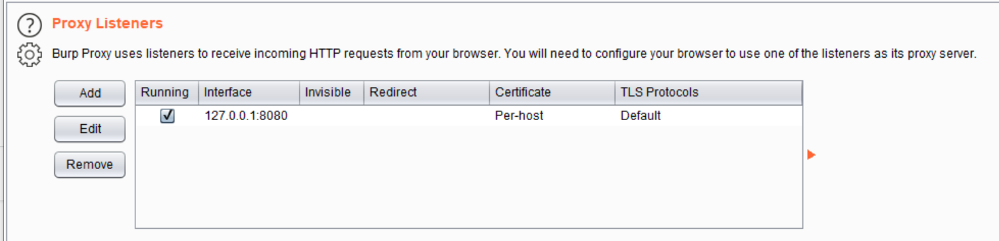

그런다음 책과 다르게 openBrowser를 통해서 해당 홈페이지를 열었다.

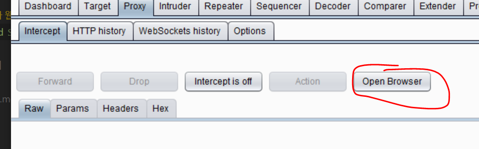
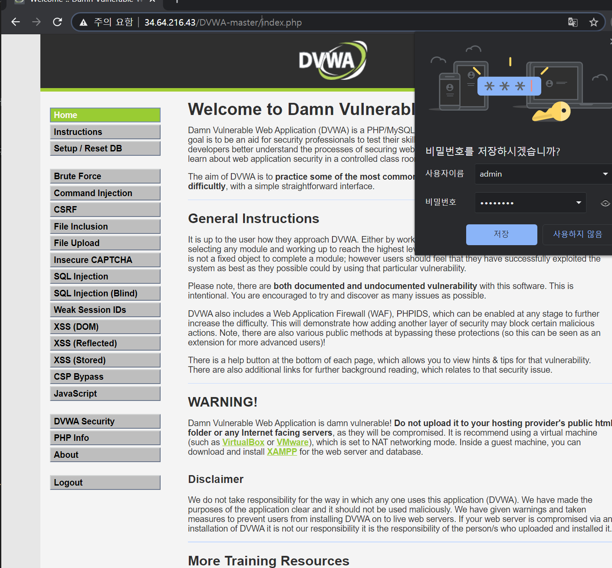

또 Impossible단계로 되어있는 것 같아 쿠키로 medium으로 설정함

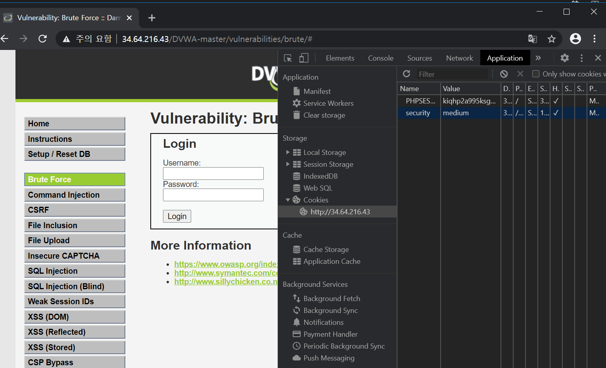

그리고 id password 재시도 해보니 됬음 책대로 슈벌

ㄹㅇ 개 불친절한 책임

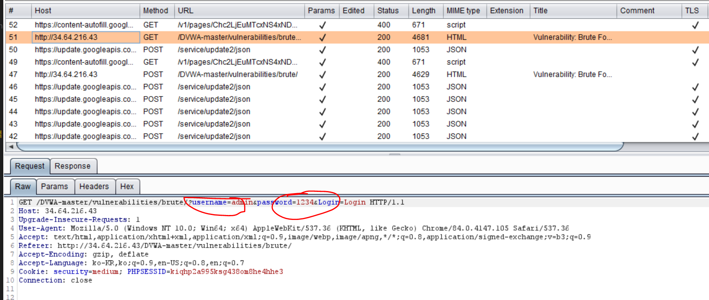

근대 보니까 medium이 아니라 low엿네? 이걸 왜 빨리 말 안해주노 이새끼드릿발

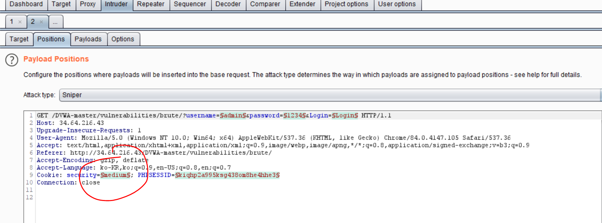

low로 바꾸고 재시도

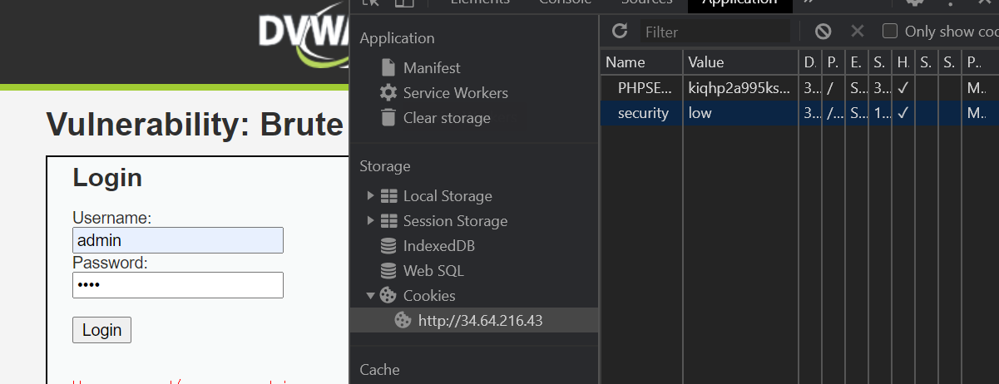

똑같이 되서 그것을 intruder에 올렸음똑같이!

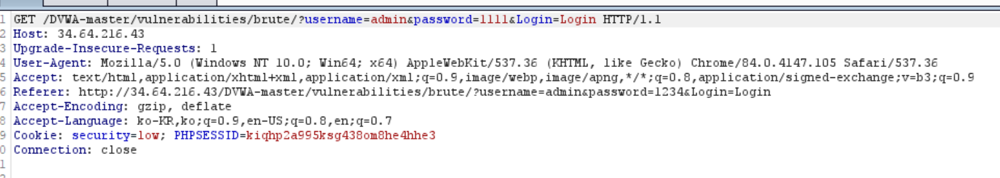
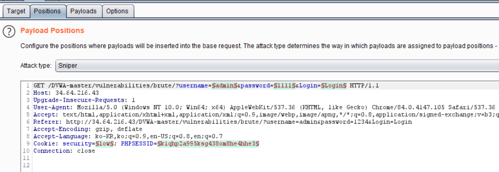

책에 나온대로 설정후 공격을 시도하니 하나의 경우의 수로 응답을 다 따지는 것을 확인 했음! 그러나 너무 오래걸리기 때문에 책에서 나온대로 사전 공격을 설정하고 다시 진행함

이렇게 설정을 하였음

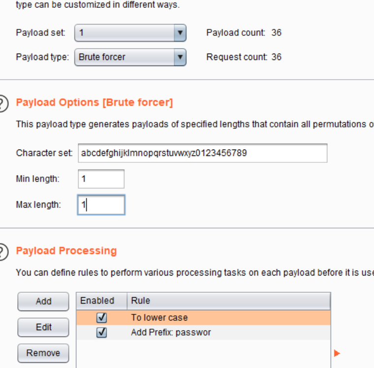

길이가 다른 응답 메세지 확인

로그인이 맞았다는 html파일을 확인!

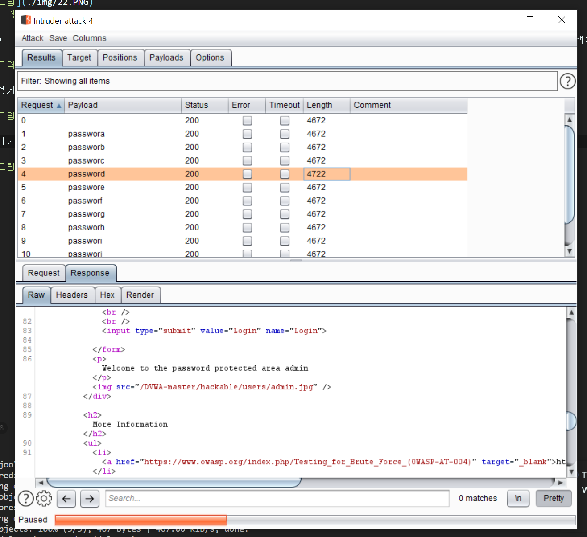

그 외 Hydra patator은 다른 프로그램 사용이니 생략했음

## 탐지법!

원인은 모르겠는데 일단 snort로그는 안들어가고 (아마 설정을 안해서 필터링된 로그가 없어서 아무것도 없어서 안들어간듯)

그리고 apache2에서 모든 로그를 카운터한 visualize를 보았음

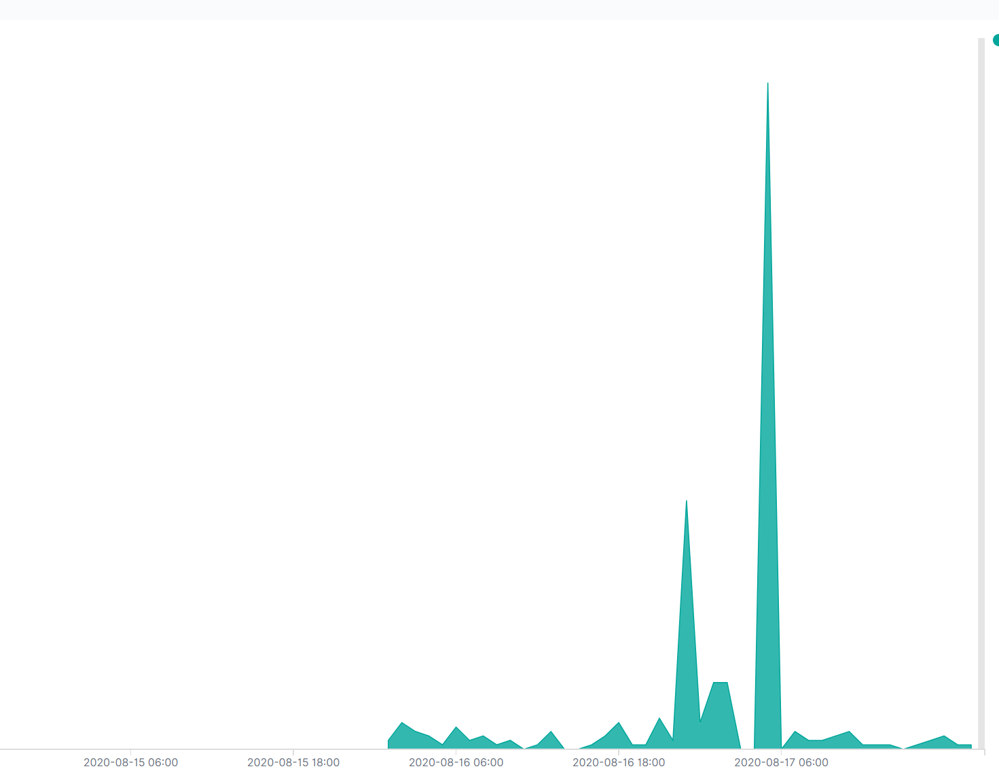

grok 문법을 익혀서 다시해야할듯 일단 여기까지 하고 윈도우 로그로 다시 복귀해야겠음...
