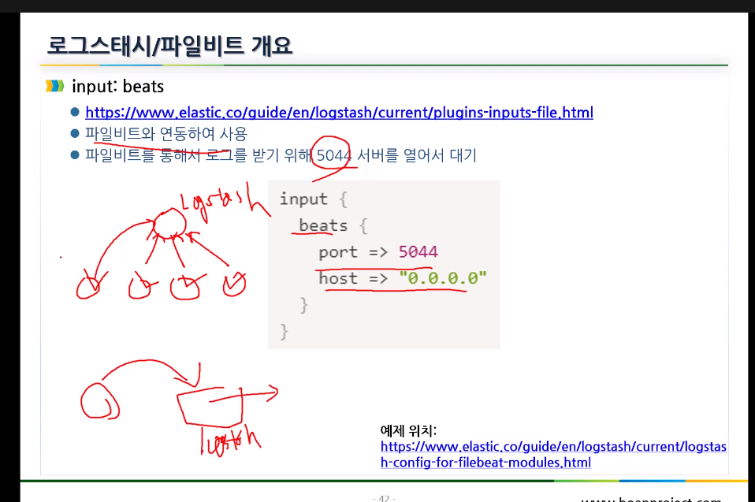
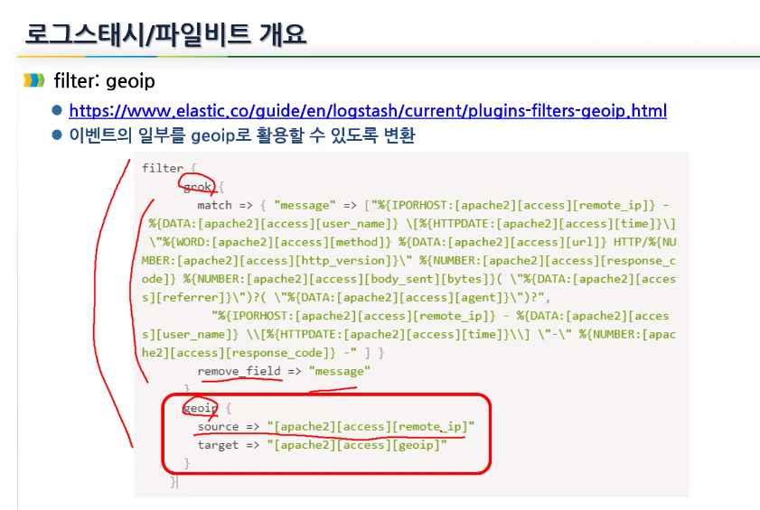

# 로그스테쉬활용한 로그 통합

제일 까다롭다. 키바나로 띄우기전에 자동화로 수집하는 것을 배움

## 로그스태시 개요

- 데이터 처리로 파이프 라인 역활
- 다양한 소스에서 동시에 데이터를 수집하여 변환
- 엘라스틱서치에 전달(가장 좋은 호환을 보임)

```txt
dats Source => input>Filters>OUTPUTS => ES
               --LOGSTASH Pipeline--
```

문법과 플러그인을 잘아야 잘 사용 가능!

## 로그 스태시의 입력

- input : filebeat, rabbit 등 수집 프로그램으로 수집 경로 지정하고 포트만 지정해주면 그곳에서 데이터를 가져옴.
- filter 종류 : GROK, GEO IP, FINGERPRINT, DATA등 각 필터를 통해 Field를 구문을 분석 및 변환해줌.
- OUTPUT: ES,메일 등 데이터 베이스로 저장이 가능! 유연성을 확보할 수 있다.

## 파이프라인 이미지


## 플러그인들 집합


각 부분에 대한 수많은 필터들

## 각부분에 대한 설명

- input: 로그스태시로 데이터를 가져옴
  - file: 파일시스템의 파일에서 읽음
  - syslog: syslog 메세지 및 구문 분석을 위해 포트514수신
  - redis: 데이터베이스
  - beat: Filebaet에서 보낸 이벤트를 처리
- Filter: 로그스태시 파이프 라인의 중간 처리
  - grok: 구조화 되지 않은 로그 데이터를 구문 분석
  - mutate: 일반적인 변환 수행 - 이벤트의 데이터 수정 및 제거
  - drop:이벤트 삭제
  - clone:이벤트 복사
  - geoip: IP 주소의 지리적 위치에 대한 정보를 추가(지도 차트에서 사용됨)
- OUTPUT: 최종 단계 - 여러출력 사용 가능
  - ES: ES에 파일 전송
  - file: 디스크 파일로 저장
  - graphite: 데이터베이스로 전송
  - statsd: statsd에 이벤트 데이터를 전송
- Codec: 스트림필터
  - json
  - multilne

## input: file


path에서 부터 데이터를 읽어온다.
begnning은 처음부터 end는 끝에서부터읽는다.

## input: beats



여러개의 filebeat를 하나의 logstash로 수집 5044포트를 열고 대기함

**파일 비트가 설치된 컴퓨터는 로그스테시에 전달**하는 그런 일 (이거 우리가 계획할것)

## filter: grok


원하는 형식으로 바꿔줄 수 있음

## filter: geoip



ip를 가져와서 source를 가져와서 (좌표가 나오고 저장)

## output:elasticsearch


HTTP프로토콜로 알아서 전송

hosts를 분산형태이기 때문에 여러곳으로 보낼 수 있음.

template제공 - 기본적인 매핑을 지원하지만 원하지 않으면 false로 셋팅하기 셋팅되면 로그의 인덱스가 logstash-%{YYYY.MM.DD}로 저장이 됨

원하는 index이름을 지정

## filebeat

굉장히 쉬운 모듈 경량화 하여 만든 수집기임.filebeat는 중앙 집중화된 작업을 간편하게 유지해 줌.

대시보드도 이미 구현된 것들이 있음.

## 설치와 실행

- 실행파일은 usr/share에, 설정 파일은 /etc/에 있음!


직접 -e 옵션으로 인풋 아웃풋 설정 가능!


filebeat의 인풋 설정 type두번째를 넣고싶으면

\-로 시작되는 type을 넣어주면 됨.

enabled 이 false면 동작을 안함 true로 바꿔줘야됨 path에 설정되어있는 로그들을 가져옴


설정된 모듈들


키바나에 설정된 주소값 - 원격이면 원격 주소를 적어야됨 localhost말고


conf.d에 설정파일들을 옮겨주고 모든 설정파일을 지정함. 따라서 주어진 예시의 설정파일을 옮겨주는 과정


filebeat를 통해 로그들이 올라 옴.

## 실습.


elastic 서버에서 logstash 설정 파일 web.conf


server부분의 filebeat 설정 파일


서버부분에서 로그를 확인하기! - 요청이 잘오는 것을 확인함


로그 갯수 확인!