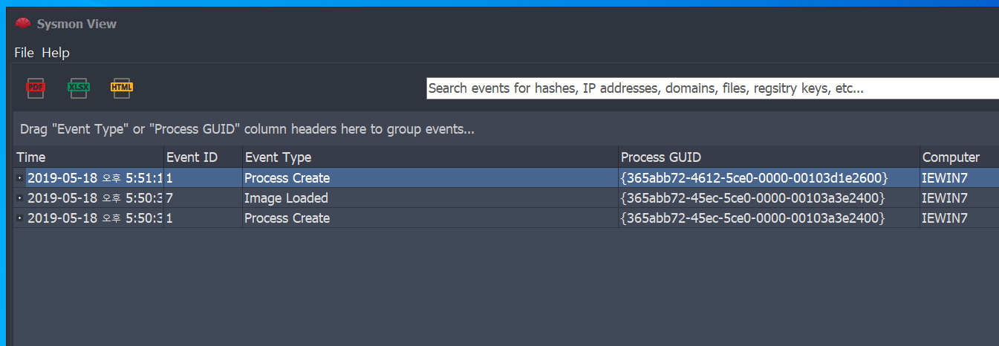
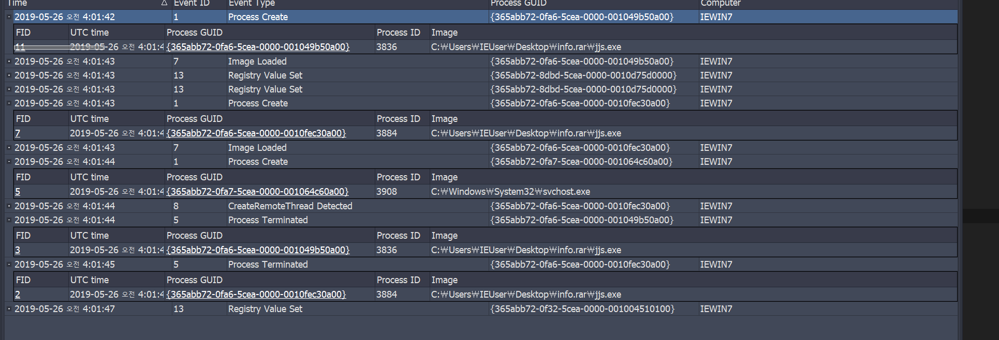

# 윈도우 로그 강화

- Sysmon을 활용한 윈도우 침해사고 준비도!
- 강화된 윈도우 로그 분석 실습

## sysmon 모니터

> 정확히 로그만 남기는 것임!

- 시스템 서비스 및 장치 드라이버로 작동이 됨. - kernel 영역에서 돌아감 (user영역의 소프트웨어는 kernel영역의 소프트웨어를 막기힘듬)
- 커널영역까지 로그를 남길 수 있음
- 서비스는 부팅이 되도 이 서비스가 상주하여 시스템 활동을 모니터링
- 정보를 이벤트 로그에 기록. - 프로세스 생성, 네트워크 연결, 파일 생성 시간 등 자세한 정보 제공
- Event Collection또는 SIEM을 통해 에이전트를 사용하여 이벤트 수집과 분석 가능
- sysmon은 이벤트의 분석을 제공하지 않음.
- 서비스 목록에 자신을 숨길수 있음

## 사고 대응 필요성 계층 구조

## why sysmon?

기존에 어려움이 존재

- 탐지되지않은 멀웨어(?)공격이 존재
- 프로세스나 파일들의 해시를 남기기 어려움.
- 이벤트 수집환경 통합 가능
- 프로세스 생성과 네트워크 연결을 연관 짓기 어려움
- 스레드 인젝션, 드라이버 로드 등의 탐지가 어려움
- 솔루션 비용

## sysmon 아키텍쳐

필터링 사용 가능!

## sysmon의 특징

- 프로세스 생성 전체 명령줄을 기록함!
- 해시 값을 원하는것으로 기록 가능
- 프로세스 ID를 다시 사용하는 경우에도 이벤트가 연계될 수 있도록 이벤트에 프로세스 GUID를 기록함!
- 드라이버, DLL 디스크 읽기권한 등 기록
- 네트워크 연결 다 기록
- 변화를 감지해 실제로 파일이 생성된 시기 파악
- 레지스트리에서 변동된 경우 자동으로 구성을 다시로드
- 필터링 룰 사용 가능

## Sysmon 로깅 정보 예시

Command Line에 인자로 전달된 것도 다 볼 수 있음

Guid는 남아있어서 그대로 사용 가능

해쉬 값을 기록

## 시스몬 설치와 소개

sysmon -c 설정 변경

설치 확인됨

처음엔 네트워크 관련된 것을 남기지 않는다.

네트워크 관련 이벤트 3 번이 나오는 것을 확인 - http 통신은 남기지 않음 - 너무 많은 정보가 오고가기 때문

현재 나의 구성환경

## 각 필드의 의미

4번은 특히 악의적인 종료를 탐지할 수 있기 때문에 기억해두기

이미지 로드 - exe파일 실행, DLL올리는 것 두개다 이미지 로드임 범주가 넓음. - 그러나 프로세스 생성과 관련되어서 중요한 로그이다. 필터링을 잘해야됨

8번 - 악의적인 코드 탐지를 위해 필수. - 원격으로 스레드를 만들때

9번은 악성프로그램이 주로 사용한다.

10번도 리드 라이트 실행할때 접근하는 것.

11번도 유력한 위치로 필터링 하는게 좋음

12번 자동 시작위치 특정 맬웨어에 필터링

255번 오류도 잘 감지하기

WMI는 window manager interface임. WMI api는 악성코드도 같이 사용할 수 있음.

[업데이트내역확인링크](blogs/technet.microsoft.com/sysinternals/)

## 주요 이벤트 ID별 로그 포함 내용

## 필터링 예제 - 정답이없고 사용 용도에 따라 구성을 생각해야됨.

종료 시간은 중요할 수 도 있음

## 필터링 실습

이벤트 이름의 순서는 맞출필요없음

## 필터링 정의 실습!

요구사항

conf 설정 값

성공적인 적용

## SysmonTools

오픈소스이고 가장 쉬운 시각화 프로그램

시스몬 뷰 사용법

xml파일로 로그들을 보낼 수 있음

그리고 fiter rule을 쉽게 정의할 수 있는 프로그램

## 실습 과정

View와 Shell을 sysmon이 있는 폴더로 같이 묶어놔야 편리함

Shell에서 rule을 정의하는 모습

로그들을 xml파일로 추출

처음 불러올 땐 Import Sysmon~

두번째 추출된것을 불러올땐 existing data

geo ip 체크해야 네트워크 ip가 좌표로 찍힘

## Windows 이벤트 셈플 분석 실습

샘플을 불러온 결과

cmd에서 명령어에 어떻게 쳣는지 보고 뷰어를 통해 함께 로그 분석

악성코드들이 보통 temp경로를 많이 이용.

dll파일이 언제쓰여졌는지 이런것도 확인 꼭 하기.

마지막 실습 이벤트 로드한 화면

가장 먼저 프로세스 create regist value set등 을 먼저 보기! - 시간순서로 정렬한뒤에

계층구조로 파악하기 - 이미 감염이 된 jjs가 실행이 되는듯

프로세스 뷰에서 실행이 두번 될때 부모 프로세스가 다른 것을 확인

scvhost파일의 껍데기를 jjs를 실행시키게 되게끔 심어줌! 악성코드 의심

서비스를 등록하고 자동실행으로 바꿔준 것 같은 내용.

## ELK 연동

ELK sysmon 검색해서 차트 참조하기
