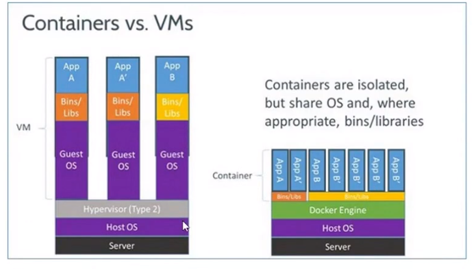
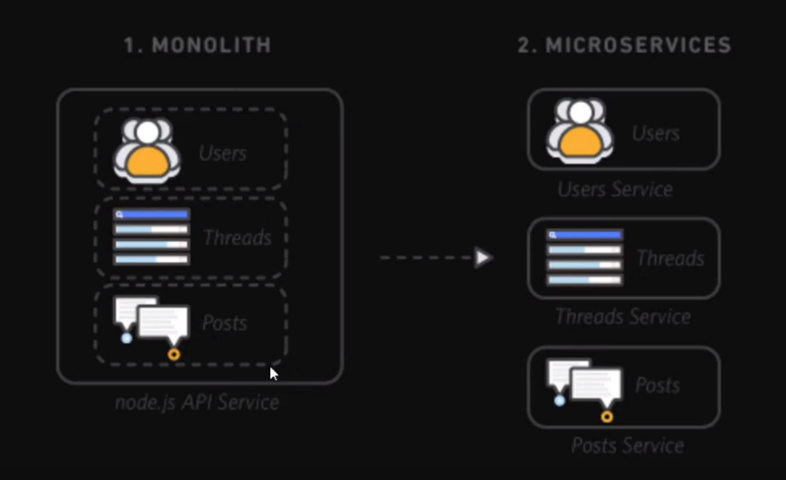
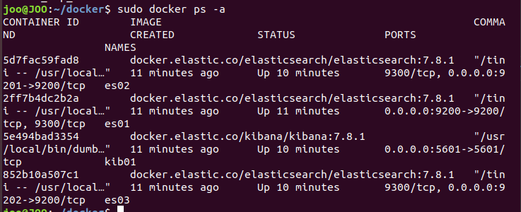

# 도커 컴포즈와 엘라스틱 클러스터 구현

## 도커와 컨테이너는 왜 필요할까?

개발팀과 운영팀이 보통 적대적이다.

개발팀은 **개발**을 한다.

그래서 새로운것을 추구하고 새로운 것을 만들어내는 욕구가 있다.

그러나 운영팀은 안정적인것을 추구하기 때문에 안정적인 infra를 추구한다.

따라서 추구하는 게 다르다.

개발팀은 여러 개발팀에서 파이썬, 자바, 고 등 다른 언어로 개발을하고 그것을 충돌 되지않게 하나의 컴퓨터에 돌아가게 하려면

가상환경이란것을 사용하고 환경을 새롭게 구축해서 환경을 구성한다. 그러나 vmware나 vbox는 프로그램이 무겁다. - 하드웨어를 추상화시켜서 부하가 심함.

vmware와 container의 아키택쳐는 다음과 같다.

## 도커에서 사용하는 기술

리눅스 컨트롤 그룹 (cGroups)

리눅스에 있는 기능을 이용하여 가상화

윈도우는 하이퍼바이저를 이용해 가상화

또한 리눅스 네임 스페이스를 사용한다. - 도커의 작동원리

## 서비스 아키텍쳐

온프레미스, 모놀리식 마이크로서비스

서비스가 다르지만 마치 하나의 앱에서 보이는 것처럼 느낌.. - 버그 발생하면 하루종일 들여다봐야됨

모놀리식은 컴파일, 즉 적용이 오래걸린다.

마이크로서비스는 부품교체 형식으로 하기 때문에 서비스를 따로 개발한다.

이때 컨테이너를 사용하면 기술을 도입햇을때 그대로 호환이 됨

그리고 복사했을 때에도 모놀로식은 다 복사되지만 마이크로서비스는 필요한 부분만 하면 됨.

의존성을 따지지않고 컨테이너를 사용해 가상화를 하기 때문에 수백개의 서비스가 한꺼번에 돌아가도 지장이 없음 - 아마존과 넷플릭스, 배민, SDS

쿠버네티스 - 도커를 관리하는 기술. 구글이 녹여놓은 기능을 쿠버네티스로 풀어냄

도커 - 쿠버네티스 => 컨테이너하면 대표되는 기술

도커와 쿠버네티스를 배워보장~!

## 도커에 엘라스틱 올려보기

docker ps로 컨테이너 상태 확인

컨테이너 안으로 접근 가능!
