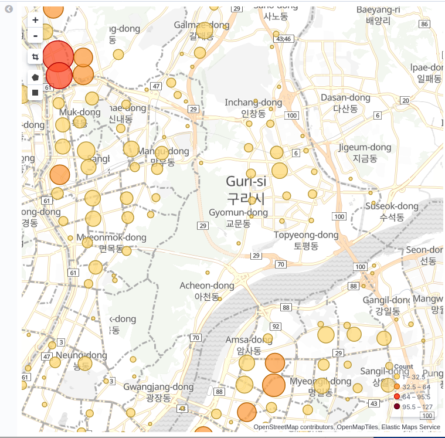

# 엘라스틱 서치 실제 사용 예제

## 국민 청원 데이터 분석!

여기서 타이틀이 누락이되서 제대로 못만듬 ㅠㅜ

파이썬 코드와 모두 다 실습은 나온대로 진행!

맵핑과정이 손수작성이되서 누락이 된거 가틈

문제점이 keyword형이 없어서 aggregation이 안되는데 검색으로 원인을 못찾음 ㅠㅜ

## CCTV데이터 분석

geopoint로 맵핑한뒤에 다시 적용한 것을 실습 그리고 visualization에서 확인!

카메라 갯수가 string으로 맵핑이 되었음 ㅠㅜ

데쉬보드 완성!