# 공공데이터를 활용해 ELK와함께 시각화 하기

## 파이썬으로 엘라스틱 서치 다루기..

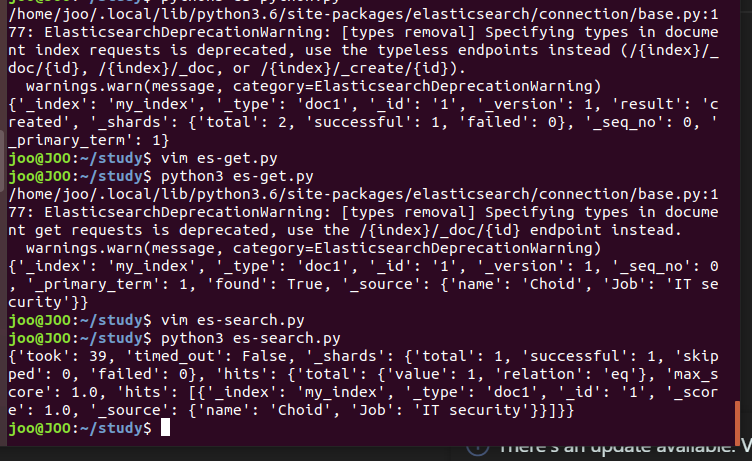

강의에서 코드 따라친걸 실행한 결과

오류메세지는 뜨지만 결과가 나와서 고치지 않음! 그리고 파이썬의 장점인 여러 모듈과 같이 사용할수 있다는 감각을 느낄수 있었음.

## 노리 개요, 설치, 사용 방법

1. 개요

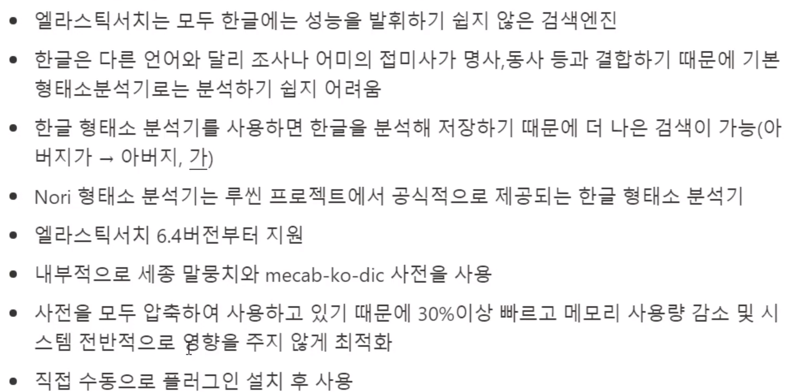

검색엔진이 한글은 조사 이런게 띄어쓰기가 매우 어려워서 분석이 힘듬

2. MeCab

세종 프로젝트에서 한국어 말뭉치 개발, 루씬에는 버전 3.6버전 부터 일본어 형태소 분석기가 포함

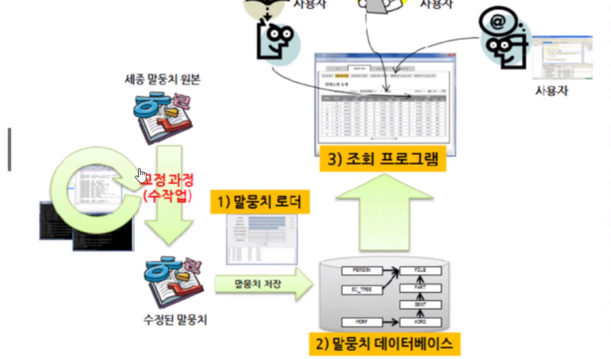

말뭉치 검색시스템

3. 동전한닢 프로젝트

mecab-ko-dic에서 사용

4. 형태소가 없을 때

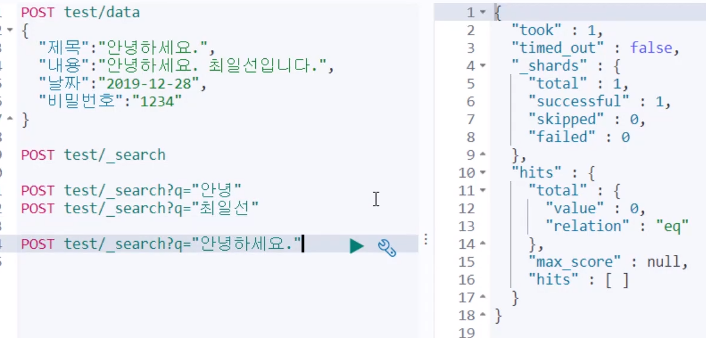

형태소 분석기가 없어서 최일선, 안녕이란 단어가 검색에 true로 반환이 안됨.

5. nori를 설치후 분석결과

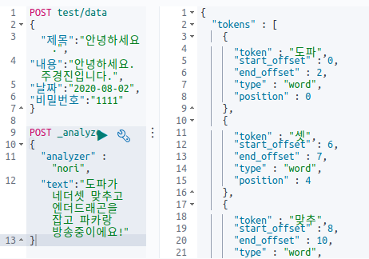

## 노리 토크나이저와 토큰 필터

- nori_tokenizer : 공백, 문자 , 구두점을 사용해 하나의 데이터를 나누는 역활
- nori_part_of_speach: 토큰필터
- nori_readingform: 토큰필터

토큰 필터는 단어들을 검색가능하도록 제공해줌

### 노리 토크나이저

decompound_mode: 토크나이저가 복합 토큰을 처리하는 방법을 결정

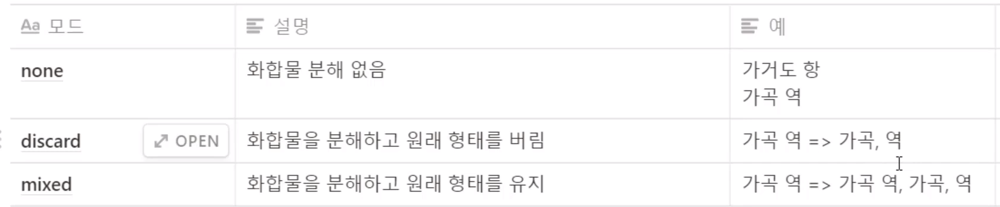

사용법은 이렇게 됨.

user_dictionary => 사용자가 원하는 dic을 통해서 분석한다.

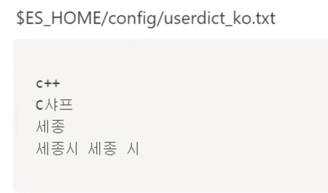

유저 딕 설정 모습

### 노리 기능을 커스터마이징해 사용

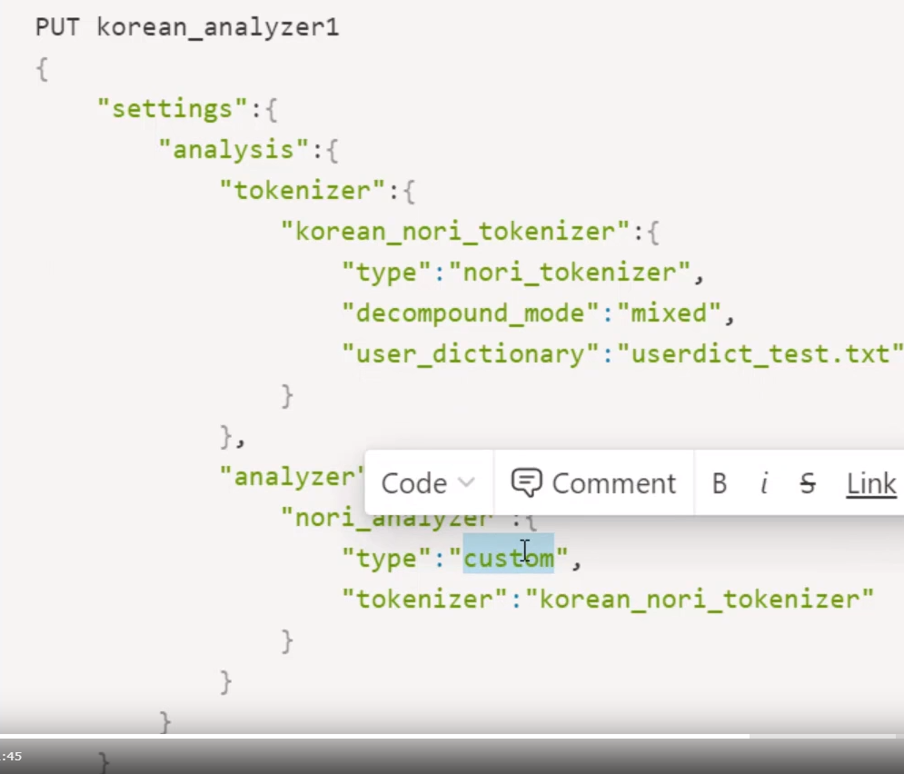

타입은 사용자 지정, 토크나이저는 정의한 이름

그리고 토크나이저에서 분해물과 혼합물 다 존재하도록 하게 설정
그리고 원하는 파일 불러와 토크나이즈 설정 - userdict_test

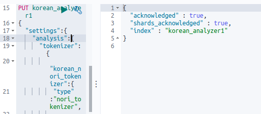

실습 설정에따라 에널라이즈 설정

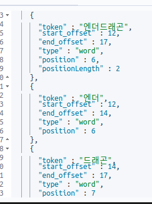

설정된 대로 엔더드래곤을 엔더,드래곤,엔더드래곤으로 다 나옴!

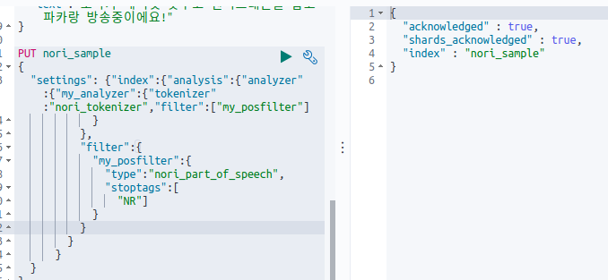

NR 필터 셈플

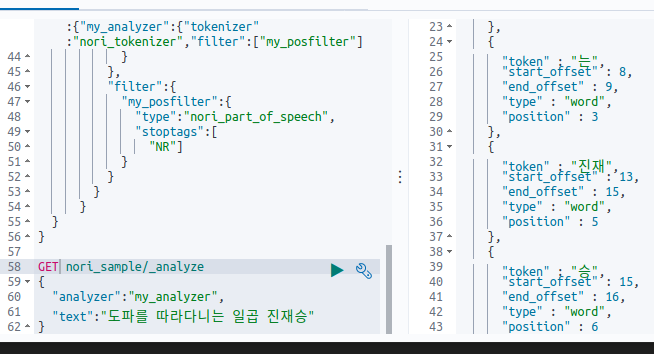

일곱이 사라짐!

## 실제 인덱스에 적용하기!

처음에 매핑 작업이 필요함!

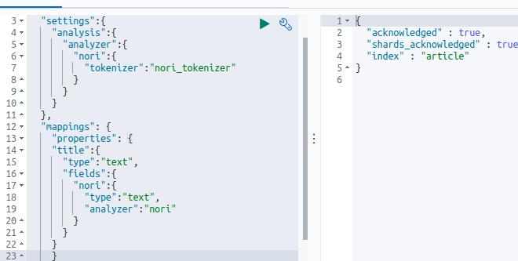

매핑작업 완료!

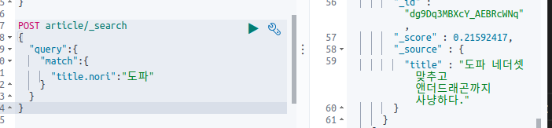

검색할땐 .nori로 지정을 해줘야 노리방식으로 검색이 가능!

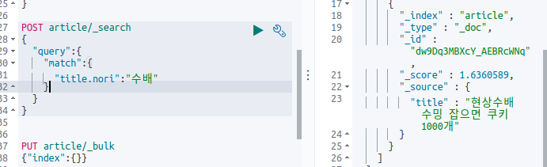

형태소가 알맞게 분리되는 것을 볼 수 있음!!
