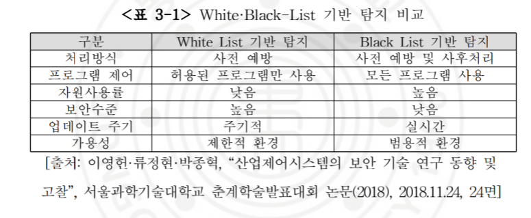
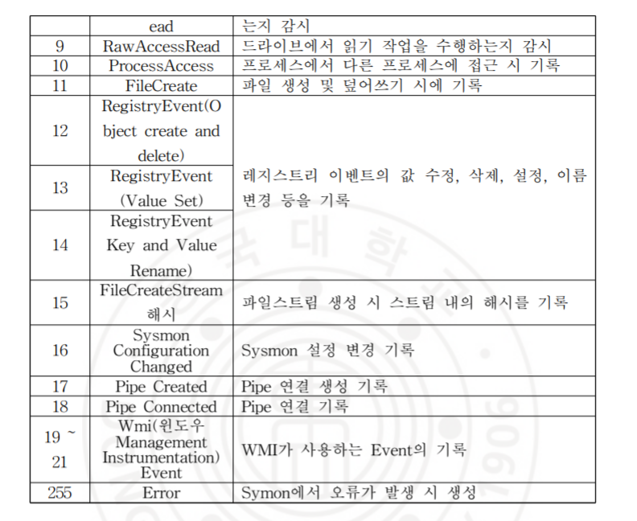
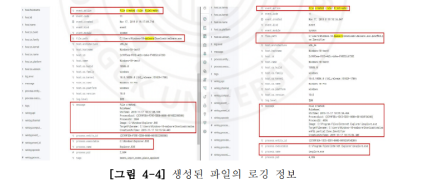
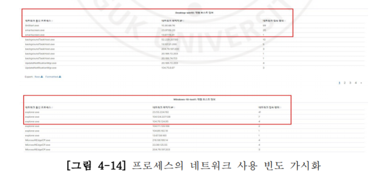
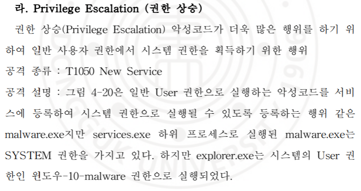
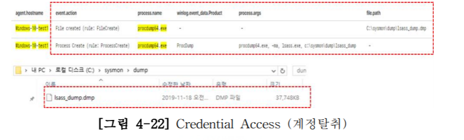

# Sysmon과 ELK Stack를 이용한 윈도우시스템 사이버 위협 탐지 및 가시성 증대에 관한 연구

[링크](http://www.riss.kr/search/detail/DetailView.do?p_mat_type=be54d9b8bc7cdb09&control_no=0c00a0f999d28bccffe0bdc3ef48d419)

## 서론

### 연구 배경

2017년 우버,버라이즌,에퀴팩스 등 대형 기업의 대규모 개인정보 유출사고 있었음.

대부분 엔드포인트 보안 백신은 피해 받은 단말기를 분석하는 방식임.

이미 설치된 프로그램이나 OS에서 제공하는 S/W유틸리티를 활용한 living off the land 형태의 공격이 활성화 되는중.-Malware 기법

따라서 sysmon을 이용해 분석하는 방안이 필요해짐.(이미지로드, 드라이버 로드, 레지스트리 생성 및 수정, 커맨드 명령 이벤트 등)

이 논문의 목적은 **Legacy 보안시스템을 우회하는 사이버 위협 탐지** 를 위해 많은 양의 로그를 Sysmon으로 수집해 실시간으로 ELK Stack에 전송.

### 연구의 범위

보안프로그램을 우회하는 방식의 공격을탐지, 네트워크 보안 시스템과의 연계 등.

## 개요

### 시스몬

Sysinternals에서 무료로 제공되는 윈도우 시스템 모니터링 도구

탐지 범위는 다음과 같다

| 범위               | 내용                                                                   |
| ------------------ | ---------------------------------------------------------------------- |
| 프로세스 정보      | 실행된 프로세스와 상위프로세스 전체에 대한 **프로세스 생성 여부** 기록 |
| 프로세스 정보      | 프로세스 **실행시간**, **종료시간** 기록                               |
| 프로세스 정보      | 프로세스에서 **실행된 네트워크** 및 **파일생성**이벤트                 |
| 프로세스 정보      | 프로세스 이미지파일의 해시 제공, 여러개의 해시 사용가능                |
| 네트워크           | 연결시도 프로세스,정보, IP주소,Port정보,호스트 등 기록                 |
| 파일 및 레지스트리 | 실제 생성된 시기를 파악하여 기록과 레지스트리 생성 및 변경에 대한 기록 |
| 기타               | 윈도우 명령어(CMD,Powershell,WMI)                                      |

**추출한 해시값을 사용해 CTI사이트에서 조회해 악성코드 여부를 확인가능**

20개의 카테고리로 이벤트로그를 저장

모두 수집하면 과부화 된다. 가시성 중대를 위한 로그만 수집하기!

sysmon shell을 이용한 템플릿 적용도 한가지 방법

### 엘라스틱 서치

인덱스 : 유사한 특징을 가진 데이터의 모음 - DBMS에서 데이터베이스와 유사한 개념

샤드: 인덱스의 subset - primary 샤드- 기본 인덱스 replica 샤드 - 복제된 데이터

## 보안 프레임 워크 변천사

### ESM(통합보안관리 - Enterprise Security Management)

보안 솔루션 + 네트워크 장비를 상호연동하여 효율적으로 운영

상호 연관분석이 제일 많이 쓰이는 분석방식

상호보완분석: 보안프로그램에서 발생한 로그 ,시스템 정보변경, 방화벽, IPS등과 같이 복수의 시스템을 서로연계하여 분석

### SIEM(보안정보 및 이벤트 관리 - Security Information and Even Management)

정책 or 시나리오 기반으로 동작(우리가 지향하는 방향)

**비교표**

| 항목               | SIEM                                                                                                                                                               | ESM                                                                                            | SIEM의 차별점                               |
| ------------------ | ------------------------------------------------------------------------------------------------------------------------------------------------------------------ | ---------------------------------------------------------------------------------------------- | ------------------------------------------- |
| 정의               | 기업 내에서 발생하는 모든 자원,이벤트를 통합관리 and 로그 수집및 보안 모니터링 관련 규제를 준수                                                                    | 보안시스템을 중앙에서 통합적으로 모니터링하는 시스템                                           | 장애관리관점->운영 및 분석 규제 준수로 확대 |
| 관리/분석대상      | 보안시스템,소프트웨어,서버시스템,네트워크 장비, 이벤트, 구성정보, 네트워크 흐름 등                                                                                 | 보안시스템,서버시스템,로그,이벤트 등                                                           | 관리 및 분석 범위 확대                      |
| 핵심용도           | 보안위협 예측, 기종관 상관분석, 대용량 데이터 분석                                                                                                                 | 보안위협 발생시 대처, 시스템별 가용성 체크                                                     | 최신 보안위협 trend 대응                    |
| 위협탐지특징       | IP,Port외 애플리케이션,사용자단위,프로토콜 연관성 분석 및 탐지 and 다양한 시나리오 적용 and APT등 알려지지 않은 공격 및 공격간에 연관성 분석 장시간 범위 분석 수용 | IP, Port등 시그니처 중심의 네트워크 계층 탐지, 단순 패턴 기반 탐지, 알려진 공격위주 분석       | 연관분석지원                                |
| 수집/저장          | 기업내에서 발생한 모든 자원,이벤트 통합 수집, and 정형/비정형 데이터 수용 and 수집 데이터 보존 1년이상                                                             | 보안 현황 모니터링에 필요한 event 정보 위주 and 정형데이터 기준 and 수집 데이터 보존 2개월정도 | 광범위 데이터 처리 및 장기관 보관           |
| 수집/분석 아키텍쳐 | AGENT 이외에 다양한 프로토콜 활용한 데이터 수집, 빅데이터 처리기반 상관분석 and 초당 3~5만건 이상 병렬 처리 구조                                                   | Agent, API위주 데이터 수집, RDBMS 기반 상관분석 초당 3천건                                     | RDBMS기반의 처리속도 지연을 극복            |
| 시각화             | 대시보드,정형 보고서,시각화 보고서 제공                                                                                                                            | 대시보드,정형보고서                                                                            | 다양한Report 지원                           |
| 탐지오류           | 비교적 적음                                                                                                                                                        | 비교적 많음                                                                                    | 탐지정확도 UP                               |

### EDR/EPP(EndPoint Detection & Response/Endpoint Protection Platform)

엔드포인트에서 지속적인 모니터링과 대응을 제공하는 보안 솔루션
EDR 솔루션은 차단,격리와 같은 즉각적인 대응이 가능.

이벤트 정보기반으로 연관 분석을 실행하면 알려지지않은 위협을 조금더 일찍 발견 가능

ex) 처음으로 실행된 프로세스명, poshell등 shell 프로그램을 활용한 이상행위, 악의적인 네트워크 통신 등 시스템에서 로그를 수집해 지능적 공격에 대비 가능

### 위협 분석

예방을 하려면 위협 분석을 위한 여러방안이 필요함.

파일리스 기술을 이용해 공격대상 시스템에 이미 배포된 프로그램에 합법적으로 들어감...

데이터 & 데이터와 이벤트를 분석하는 기술. 네트워크 트래픽, Perimeter에 이쓴ㄴ 장비(라우터,파이어월,웹방화벽,IDS/IPS)의 로그,엔드 포인트에서 추출한 정보,외부에서 수집한 정보(도메인/후이즈DB관련 정보, 위협정보) 들이 필요.

### 보안 분석 인텔리전스(OSINT - OpenSource Intelligence)

외부에서 공개된 시스템/프레임워크를 통해 얻은 지식,통찰정보

1. CTI(Cyber Treat Intelligence)

사이버 위협들의 정보를 수집하고 이를 침해지표(IOC)로 정리하여 새로운 위협과 비교분석 하여 연관성을 찾는것.

예시로 [malware.com](malware.com)/virustotal.com(virustotal.com)

공격자가 누구인지, 어떤형태로 침입했는지 - 단계별로 탐지 및 방어전략을 세워야됨.

ex) 공격자가 사용한 IP주소, 악성 코드, 명령제어, 도메인 주소, 해시정보 - 탐지하기 위한 Snort/Yara Rule, TTP등을 공유.

APT, SOC에서 공유되는 정보를 이용해 발생할 수 있는 공격을 사전에 차단/탐지 할 수 있음.

국가 정보보호 관련 기관 or 기어벵서 공유하는 CTI정보 공유를 통해서 참고가 가능하다!

### MITRE ATT&CK

다양한 해킹기법 12가지의 공격방법으로 분류 했고, 총 219가지의 개별 기술 항목을 분류하고있음.

### shodan

Device 검색플랫폼 - 디바이스 정보 검색 엔진임.

라우터,스위치,FTP서비스,특정 웹 서버 정보 등을 수집하고 그 결과를 검색할 수 있도록 보여주는 사이트임. 기억하기!

사용방법의 예시는 다음과 같음.

1. 검색어 'apache'웹서버를 검색어로 놓음
2. xml형태로 export하거나 그래프 형식으로 보여줌
3. 검색 키워드에 대한 shodan의 전체 검색 결과를 보여줌
4. 국가단위로 세분화해서 검색 가능
5. IP정보, 국가별 정보, 해당 사이트에 접속했을 때 축약된 banner 정보를 보여줌.

## Legacy 보안의 문제점 및 가시성의 한계

(legacy는 오래된이란 뜻으로 옜날것의 보안을 말함)

항상 옛날 방식은(백신,NAC,DRM,DLP 등) security hole이 발생하기 때문에 이러한 문제점을 EDR,EPP와 같은 솔루션 형태의 보안 제품들이 나옴!

아래는 Legacy 보안 탐지의 한 방법임.

### CTI(위협 인텔리전스) 기반 탐지

인터넷 평판 정보 조회 사이트 or 기업에서 구축한 사이트를 이용하여 과거 공격탐지 이력 정보, 악성 행위 유무 등 평판정보를 확인하는 방법.

그러나 신뢰된 sw를 이용하여 공격을 이뤄지면 탐지가 잘 안됨.

CTI정보를 제공해주는 사이트가 많으나 정확도를 판단하는것은 우리의 몫

### 시그니처 기반 탐지

잘알려지거나 분석이 완료된 공격에 매우 효과적

새로운 공격에는 취약함 - 지속적으로 개발해야되는 비용

### 엔드포인트 보안 로그 분석

백신, DLP,DRM 등 보안로그를 통합 하여 도출한 시나리오와 4W2H를 이용한 사용자 행위기반으로 발생하는 보안위협 식별정보 들을 위험도 가중치를 부여! -> 주의,경고,위협단계로 보안을 식별하게 함

기본적으로 엔드포인트에 여러 보안 솔루션이 구축되야됨구

다양한 보안 로그를 통합하는 것은 각 로그 데이터에 의미를 부여해야 하므로 다중 보안 로그를 통합하여 위협을 분석하는것은 어려움

### 이상 행위기반 탐지

수집된 트래픽, 데이터를 바탕으로 IDS구축 일반적인 행위 패턴에서 벗어난 이상 행위를 탐지하기 때문에 알려지지 않은 침입 방법까지 탐지 가능.

그러나 정상적인 작동수준에서 공격하면 탐지 못함.

### Black-White List 기반 탐지

(우리가 사용할 방법인듯..)

sw설치 및 업그레이드식 일시적 서비스 중단, 새로운 sw가 들어오면 관리자가 검증하고 화이트리스트에 등록해야하는 관리부담이 잇음.

## Legacy 보안 탐지의 한계점

### 파일리스 공격탐지의 한계

악성 코드가 곧바로 시스템 메모리에 로드되어 실행되서 파일 형태로 존재하지 않는 파일리스라 부름

(실행 예시로 어떤 웹사이트를 접속하면 자동을 ㅗexplore.exe가 계산기를 실행함.)

이 방식은 기존 보안솔루션에서 탐지 할 수 없거나 부분적으로 만 탐지할 수 있음.

### Living off the land 공격 탐지의 한계

cmd, powershell과 culr wget등 합법적인 어플리케이션으로 가지고 있는 취약점을 exploit하여 공격자의 목표를 이루어내는 행위임.

이공격 방식의 이점을 표로 정리하면 다음과 같다

| Living off the land 공격방식                              | 탐지 우회 방법                                                                                                                                                         |
| --------------------------------------------------------- | ---------------------------------------------------------------------------------------------------------------------------------------------------------------------- |
| 정상적인 sw이용해 다양한 보호 대책을 우회할 가능성이 있음 | powershell, cmd등을 이용해 https사이트에서 파일 다운시 네트워크 단에서 인지 어려움. -> 파워쉘 단에서 dll injection network scan 권한 상상등의 행위에 대한 분석이 필요. |
| OS에 설치된 툴을 활용해 식별될 확률 감소                  | OS명령어를 로깅하지 않으면 어떤식으로 동작햇는지도 인지가 어렵 and 공격자가 사용했는지, 공격당한사람이 의도치않게 사용하였는지 책임 추적이 어려움                      |
| 별도로 악성 틀을 반들지 않아 공격 준비 시간 단축          | 공격 당한 사람은 별도의 툴이 필요하지 않음                                                                                                                             |

### 암호화 통신의 위협 분석의 한계

상반기 악성코드 탐지 동향임.

암호화된 사이트를 통하여 다운로드된 파일은 가시성을 식별하는 것이 어려움. 엔드포인트 로그 기반으로 파일이 언제 어떻게 어떤프로세스에서 생성되었는지 식별할 필요가 있음.

## 네트워크 & 엔드포인트 가시성의 한계

### 네트워크 정보와 연계 효율성이 부족

C&C: 악성코드를 제어하는 서버

내부 IP에서 외부 C&C로 접속하는 이벤트가 발새앟면 네트워크 단에서 확인 가능.

그러나 네트워크 단에서는 프로세스가 연결을 해줬는지, 사용자가 웹브라우저를 통해 웹서핑을 하다가 접속하게 됬는지 알수가 없음.

따라서 malware.exe를 누가 생성했고 malware.exe프로세스가 어던 네트워크에 접속하는지에 대한 데이터가 제공될 필요성이 있음.

### 엔드포인트 분석 연계 효율성 부족

한국인터넷 진흥원에서 제공하는 악성코드 은닉사이트 탐지 동향 보고서 참고하면... -> 엔드포인트에 설치된 소프트웨어 취약점을 매우 다양한 방법을 활용함.

따라서 취양한 sw나 취약버전의 sw에 대해서 내부에 사용하고 있는가 반드시 체크해야됨.

특정 프로세스가 어디서 어떤권한으로 몇번 실행됫는지 체크해서 가시성 확보해야됨

특히 sysmon을 이용해 정보의 효율성을 증대하면 좋음

## 가시성 향상 방안!(우리의 주된 주제인듯)

sysmon의 수집범위

### 시스몬과 ELK Stack의 연동 구성방안

프로세스,파일,레지스트리,WMI이벤트를 이용하여 파워셀 등에 의한 악성코드 감염이나 정상적인 윈도우 명령어를 사용을 통한 네트워크 탐닉 및 내부파일&프로세스 목록 검색 등 측면 이동을 탐지할 수 있음.

### sysmon과 elk stack의 로그 저장 구성 방안

윈도우 로그에 대한 저장량 및 저장 기간에 대한 산정이 필요함

윈도우 7 시스템2대와 윈도우 10 시스템 3대의 구성에서

11일~ 17일까지 저장된 로그의양으로 계산햇을때 건당 933Byte크기로 저장이됨
일일 33MB의 크기로 저장이된다.

따라서 생각을 해보면 윈도우 시스템 100대에서 로그를 수집해 6개월간 보관하려면
100대 33MB 180일 = 594GB의 용량이 필요하다.

이 계산법에 따라서 한번 계산해보자

### sysmon 성능 개선방안

아무래도 프로세스, 파일 레지스트리 ,command등과 같은 행위를 모니터링 및 로깅을 하기 때문에 윈도우 시스템의 성능이 저하가 될수있다. 성능 저하를 최소화하기위해 필터링 설정을 최적해야됨.

필터링 설정 하는 법은 논문본문을 참고할것(67)

## sysmon 로그 분석을 통한 위협 탐지

### 파일, 프로세스 생성 확인

프로세스나 파일이 생성될 때 상위 프로세스가 iexploere.exe로 인터넷을 통해 다운로드 된것을 확인하는 캡쳐화면

어떤 프로세스가 엔드포인트에서 몇 번 실행 되었는지 시간을 필터로 입력하여 확인 가능

### 프로세스 상&하위 이상 행위 탐지

상 하위 정보는 위협 분석에 매우 중요한 정보.

예를 들면 엑셀에서 powershell이 실행되는 것은 매우 이례적인 행위임. -> Fileless형태의 악성행위일 확률이 높음

상하위 로깅 정보를 나타낸 캡쳐

### 네트워크 연결 행위 탐지

엔드포인트에서 C&C서버와 통신 시도하는 것을 감지해야됨. -> 목적지 IP확인하기

분석대상: 내부 호스트간 네트워크 연결, WEB브라우저,에플리케이션에서 실행되지 않은 네트워크 정보를 확인해 매우 유용한 위협 분석 정보를 얻을 수 있음.

notepad.exe로는 보통 통신을 하지 않지만 system32폴더에 있는 notepad가 3389포트로 통신이 있었다는 것을 확인할 수 있음

네트워크 연결 로그는 중요한 정보이고 확실한 정탐의 증거임으로 반드시 체크!

시스몬에서는 DEEP PACKET Inspection(DPI)정보를 제공하지 않아 단편적인 로그로 지능형 위협탐지 쉽지않음.

엔드포인트 기반 탐지체계의 정보들과 연관분석이 가능해야됨

### 윈도우 명령어 탐지

사용자가 잘 사용하지 않는 명령어 또는 공격자가 사용하는 명령어를 감지해야됨. - 로깅으로 확보해 분석

정찰 단계에서 윈도우 방화벽 종료 명령, 포트추가, 윈도우 예약작업 등록, 레지스트리 변경 등 주로 사용할 수 밖에 없는 명령어가 있다. 이것은 정상적인 행위에서도 발견할 수 있으니 횟수, 시간, 명령어의 순서 등을 같이 분석해 연관 분석이 필요. 외부 자료유출시에는 80,443port를 사용해 정상행위인것으로 위장하면 윈도우 명령어를 반드시 식별해야됨.

또한 장기간 서서히 유출시킨다면 특정 목적지IP들을 식별하고 추적,분석해야 할것임.

로그 삭제 명령어는 반드시 감지하기!

엔드포인트에서 사용되는 명령어를 캡쳐한것임.

### 파일 해시 탐지

새로운 해시값이 발견 됬을 때 악성 코드인지 식별하기 위해 해시를 3rd Party에 CTI에 비교하여 볼수 있음

또한 해시값에 대해 가시성을 확보하고 확보된 정보를 기준으로 검색하여 보거나 통계데이터를 추출할 수 있어야됨.

## ELK를 활용한 보안시스템과의 연계 방안

### sysmon과 ELKstack을 이용한 위협 탐지

측면이동 탐지: 프로세스,파일,레지스트리,WMI 이벤트를 이용. -> 네트워크 탐색, 파일 프로세스 목록 체크

### sysmon 로그 초기 분석

일반 적으로 잘 사용하지 않은 윈도우 명령어가 비교적 짧은 시간안에 다수 실행되는 것을 탐지정책을 통해 통계적으로 분석하는 것.

프로세스 생성과 삭제, network connection을 이용한 C2 통신 시도 및 PID와 PPID, 이미지 로드, 등이 일반적이지 않으면 필터링 및 검색을 통해 위협을 탐지할 수 있음.

### 행위 & 네트워크 연관분석

사용자,관리자,sw제조사등에 인터뷰를 통해 의심되는 행위에 관해서 확인하기.

해당 조직의 네트워크 환경과 트래픽 분석을 통해 추가적인 이상징후가 있는지 연관분석

이상행위 프로세스,파일 등의 처리가 발생한 시간대의 네트워크 트래픽, 호스트 행위를 같이 살펴봐야됨.

이상징후로 의심이되면 해당 호스트를 대상으로 포렌식을 수행하고 최종 판단해야됨.

그리고 악성행위탐지 정책등 핵심 정보공유가 내 외부로 활발하게 이루어져야됨

ex)금융권에서 라이플,도깨비 캠페인, MITRE는 공격그룹 기술, 전술등 ATT&CK모델의 강조사항을 맵핑하여 정보를 무료제공

그리고 판단이 되지 않으면 전문가를 통해 분석

### 3rd Party CTI시스템과 연동

위와 같은 비정상 프로세스, 파일 및 레지스트리가 보인다면 CTI의 침해지표와의 비교를 통해 위협인지 확인해봐야됨. 유해 IP정보, 도메인 정보 매치 여부확인,워너 크라이 악성코드 처럼 윈도우 시스템에 SMB취약점을 사용하여 전파되는 경우 특정한 SW나 시스템의 업데이트로 사용되는 것인지 확인해야됨.

만약 OS의 잘알려진 파일, 드라이브인데, 정상,악성인지 해시 조회결과가 없다면 연관분석하고 관련된 취약점이 있는지 확인해야됨.

### 내부 보안 시스템과의 연동

네트워크 보안 솔루션 방화벽,IPS/IDS,SandBox등의 솔루션에서 수집된 IP,URL,DNS,FIle해시등의 위협 정보를 검색을 통해 프로세스확인을 해야됨

또한 네트워크 사용빈도를 가시화하여 일반적으로 통신하는 시도를 제외하고 외부통신을 시도하는 프로세스에 대해 가시화 하여 통계적으로 분석하는게 좋음

내부사용 소프트웨어 정보를 가시화 해야된다.

각 프로세스 별 파일 버전 소프트웨어 정보를 식별할 수 있어서 취약한 소프트웨어를 사용하는 엔드포인트를 정학히 식별해 조취를 취해줘야됨.

## 가상 시나리오 검증 - MITRE ATT&CK 방식

MITRE ATT&CK(Adversarial Tactics, Techniques, and CommonKnowledge)는 보안 운영팀이 악성 위협에 전체 탐지 및 조사 범위에서 어떤 공격에 매치되어 탐지되는지 확인할 수 있는 우수한 프레임워크 이다.

본 연구를 통해 그림 4-16처럼 MITRE ATT&CK 프레임워크에서 표현되는 11개의 카테고리 중 일부 공격을 시뮬레이션함으 로써 Sysmon & ELK Stack에서 분석 및 모니터링을 할 수 있는지 확인할 수 있다.

이것을 바탕으로 논문은 써져있음

이후 내용들은 요약할 수 있는 내용이 없고 중요한 내용이라 캡쳐로 대체함

### 초기 공격(Inintial-access)

### 악성행위 실행(Execution)

### Persistence(지속 공격을 통한 행위)

### Privilege Escalation(권한 상승)

### Defense Evasion(보안 우회)

### Credential Access(계정탈취)

### Discovery(내부 정찰)

### Lateral Movement(측명이동공격)

### Collection(중요정보수집)

### Command and Control(제어 서버 통신)

### Exfiltration(중요정보유출)

### Impact(가용성/무결성 파괴)

## 가상 시나리오 검증 - 시나리오 기반의 공격 및 분석 방법 제안

가상 시나리오 : PC단말을 직접 공격해 탐색하여 공격 대상자를 넓힌 뒤에 -> 직접 공격 수행해 C&C연결 시도->중요데이터 유출

가상시나리오의 공격단계를 정리하면 다음과 같다.

실제 가상시나리오를 적용한것은 아래그림과 같다.

c드라이므에 cy이름의 폴더를 만들고 malware.exe를 파워쉘을 통하여 다운. 지속적으로 실행되도록 레지스트리에 등록한 것을 감지한 kibana화면 (아래)

malware.exe를 실행시켜 권한상승을 시도하기 위해 winlogon.exe에 loadlibrary() api를 스스로 호출해 파일리스 형태로 remotethread를 실행.(아래 감지)

injection된 winlogon.exe를 이용해 시스템 권한으로 내부 시스탬을 스캔후 brute force공격을 수행

내부 자산 스캔으로 식별된 10.0.2.50 IP 시스템에 대하여 PsExec64.ex를이용하여 10.0.2.40 IP로Proxy 연결을 시행하여 10.0.2.50 시스템에 대한 권한을 획득하였다.(아래)

PsExec64.exe로 하여금 10.0.2.40 IP 시스템에 Remote 연결이 가능한 Powershell 명령을 실행하였다. 이후 10.0.2.50 IP 시스템은 10.0.2.40 IP 시스템으로 권한이 있는 원격 연결이 되었다. 10.0.2.50 IP 시스템에 대한 권한을 획득한 공격자는 10.0.2.50 IP 시스템 에 있는 파일을 검색 후 10.0.2.40 IP 시스템의 C:\CY 폴더로 복사하였다. 그림 4-37과 같이 파일의 생성이 모니터링되기 때문에 악성코드의 진행 내용을 모두 알 수 있다

