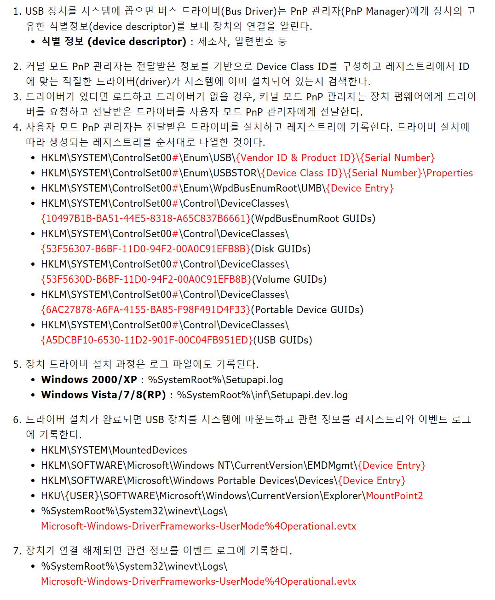

# 윈도우 이벤트 로그 기반 기업 보안 감사 및 악성코드행위 탐지 연구

## 개요

이벤트는 메타데이터(원본,GUID,기록된 날짜, 이벤트ID,작업 범주,수준)과 메세지로 구성.

공급자(원본),식별자(이벤트ID),작업범주 등으로 이벤트 구분

시스템 로그는 사용자 의도와 관계없이 생성되는 정보. - 그러나 기업내 임직원이 퇴사해 기밀유출후 안티포렌식으로 정상행위로 바꿔놓을 수 있음.

따라서 특정 행위에 발생되는 이벤트를 항상 숙지해야됨.

## 기업 보안 감사

주요 파일은 외부 저장장치, 응용프로그램, 출력물 형태 등 다양한 경로로 유출될 수 있음.

안티 포렌식 행위를 반드시 판단해야됨!

### 외부장치 연결 정보

허가된 장치만 사용할 수 있음! - 허가되지 않은 장치에 대한 정보를 추적해야됨

| event ID                                                  | 내용                                                     |
| --------------------------------------------------------- | -------------------------------------------------------- |
| System.evtx                                               |
| 10000                                                     | 드라이버 설치 - 장치에 대한 등록할때(처음 PC에 연결할때) |
| 20001                                                     | 드라이버 설치 완료                                       |
| ------------------------                                  |
| DriverFrameworks-UserMode/Operational.evtx(디바이스 연결) |
| 2003                                                      | UMDF가 디바이스에 대한 GUID,Registry key를 요청          |
| 2101                                                      | 디바이스에 대한 Pnp 또는 Power operation를 완료함.       |
| ------------------------                                  |
| DriverFrameworks-UserMode/Operational.evtx(디바이스 해체) |
| 2102                                                      | 완료된 Pnp또는 파워작업을 드라이버에게 전달              |
| 2901                                                      | UDMF가 꺼졋다                                            |

장치에 대한 레지스트리 키 정보를 2003,2101에서 얻고, 첫 연결은 system.evtx에서 정보 얻음.

> 윈도우에서 USB연결될 때 일어나는 일
>  > [참고주소](http://forensic-proof.com/archives/3632)

### 응용 프로그램 관련

허용되지 않은 클라우드 프로그램, 원격 프로그램은 외부 유출의 수단이 될 수 있음.

안티포렌식 프로그램이 설치된 이후에 새로 생성된 파일, 주요파일의 삭제된 정황을 잘 봐야됨.

MS Office의 경우는 따로 이벤트가 저장됨!
| event ID | 내용 |
| ----------------------------------------------------------------------- | ------------------------------ |
| Application-Experience/Program-Compatibility-Assistant.evtx(Windows 10) |
| 17 | 프로그램 설치 |
| Microsoft Office Alerts.evtx |
| 300 | 오피스 프로그램의 알림 내용 등 |

### 공유 폴더 사용

허가되지 않은 공유폴더에 대한 이벤트 - 해당 폴더를 생성한 PC와 접근한 PC모두 기록됨.

| EventID                                       | 작업        | 내용                                             |
| --------------------------------------------- | ----------- | ------------------------------------------------ |
| Security.evtx                                 |
| 4656                                          | File-System | 외부에서 액세스 요청 - 디렉토리, 계정 이름 등    |
| 4663                                          | File-System | 공유폴더 접근시도- 디렉토리, 계정 이름 등        |
| Microsoft-Windows-SMBClient/Connectivity.evtx |
| 30804                                         | -           | 공유폴더 서버가 연결이 해제됨 - 서버의 이름/주소 |
| 30805                                         | -           | 클라이언트가 서버에대해 세션을 잃음              |
| 30806                                         | -           | 클라이언트가 세션을 다시 세움                    |
| 30807                                         | -           | 연결을 잃음..                                    |
| 30808                                         | -           | 연결을 다시 세움                                 |

### 프린터 사용

| event ID                      | 내용                                                     |
| ----------------------------- | -------------------------------------------------------- |
| PrintService/Operational.evtx |
| 307                           | 프린트 완료 - 파일 위치, 소유자, 프린트된 페이지, 바이트 |
| 801                           | 프린팅..job?                                             |
| 802                           | 취소job                                                  |
| 842                           | 프린트기기를 통해 프린트를 요청받음                      |

짧은 시간 내에 문서 출력횟수가 많거나 출력 크기가 큰 시간대가 존재하는지 확인!

### 원격 연결/해제

근무 시간 외에 근무지 외부에서 PC를 이용할 경우가 있음. - 데이터 유출 경로.

Host와 Guest PC는 다른 로그를 생성한다.

Host->Gest
| EventID | 작업 | 내용 |
| --------------------------------------------- | ----------- | ------------------------------------------------ |
|TerminalServics-RDPClient/Operaional.evtx(Connection)|
|1024|연결|RDP가 서버에 연결시도|
|1102|연결|클라이언트가 multi-transport 연결 시도?|
|1027|연결|도메인에 연결했다. - 도메인 이름이 나옴|
|Security.evtx(Disconnection)|
|4689|프로세스종료|mstsc.exe가 종료됬다. - RDP프로그램|
|TerminalServics-RDPClient/Operaional.evtx(Disconnection)|
|1105|연결해제|multi-transport 연결해제|
|1026|연결해제|RDP가 연결해제됨|

Guest -> Host
| event ID | 내용 |
| ----------------------------- | -------------------------------------------------------- |
|TerminalServices-RemoteConnectionManager/Operational.evtx(Connection)|
|261|RDP연결의 응답을 받음|
|1149|원격데스크톱 - 유저인증 성공.|
|41|원격 새션 시작!|
|TerminalServices-LocalSeesionManager/Operational.evtx(Disconnection)|
|24|RDP 세션이 연결이 끊킴|
|25|RDP 세션 재접속|
|42|세션 엔드|

### PC시작/ 종료

| event ID                 | 내용                                                            |
| ------------------------ | --------------------------------------------------------------- |
| System.evtx(PC Startup)  |
| 12                       | 운영체제 시작 - system time으로 기록                            |
| 6013                     | 시스템 업타임..                                                 |
| System.evtx(PC Shutdown) |
| 13                       | OS 종료 - system time으로 기록                                  |
| 1074                     | ㅇrestart or power off 시작할 때 기록 - 컴퓨터 이름,셧다운 종류 |

12,13번은 시작/종료시간, 6013번은 작동 시간에 대한 정보 - 부팅 후 흐른 시간을 초 단위로 나타냄.
근무 시간외에 이와같은 흔적이 남았다면 어떤 행위를 했는지 조사하기.
출퇴근 시간과 이시간을 조사하기

### 로그온/오프

| EventID                               | 작업  | 내용                                |
| ------------------------------------- | ----- | ----------------------------------- |
| User Profile Service/Operational.evtx |
| 1                                     | -     | 로그온 알림을 받음                  |
| 2                                     | -     | 유저 로그온 끝났다고 알림           |
| 3                                     | -     | logoff알림을 받음                   |
| 4                                     | -     | 유저로그오프 끝 알림 밭음           |
| Security.evtx                         |
| 4648                                  | LogOn | 자격증명을 사용하여서 로그온 시도   |
| 7002                                  | -     | 자격증명을 사용하여 로그오프를 시도 |

### 절전 모드

절전모드가 근무시간동안 많다면 근무 태만으로 판단할 여지가 있음.- 자동으로 sleep인지 사용자에 의한 sleep인지 구분하기

PC를 사용하지 않으면 시스템 유휴 시간 으로 기록이 됨.

| EventID               | 제공자             | 내용                             |
| --------------------- | ------------------ | -------------------------------- |
| System.evtx (Entered) |
| 42                    | Kernel-Power       | 시스템 sleep모드로 들어감 - 이유 |
| System.evtx (Resumed) |
| 1                     | PowerTrobleshooter | d=시스템 재개, waketime기록      |

### 네트워크 연결/해제

| event ID                        | 내용                                   |
| ------------------------------- | -------------------------------------- |
| NetworkProfile/Operational.evtx |
| 10000                           | 네트워크 연결-이름,설명,타입,상태,분류 |
| 10001                           | 네트워크 해제-이름,설명,타입,상태,분류 |

### 이벤트 로그 삭제

일반 사용자는 삭제하지 않기 때문에 안티 포렌식 행위로 의심.

특정 행위와 관련된 로그파일이 삭제되었는지 확인할 필요 있음!

| event ID      | 내용                                                                      |
| ------------- | ------------------------------------------------------------------------- |
| System.evtx   |
| 104           | 시스템로그가 삭제됨 - 대상 파일의 이름을 기록                             |
| Security.evtx |
| 1102          | 로그가 삭제됨 - securty id 와 account 이름,도메인 이름, 로그온 id 등 기록 |

### 시스템 시간 변경

조작하기 위한 행위를 했는지 확인.

| EventID                   | 제공자               | 내용                                            |
| ------------------------- | -------------------- | ----------------------------------------------- |
| System.evtx (Entered)     |
| 1                         | Kernel-General       | 시스템 시간이 변경됨. 새로운 타임zone,변경 이유 |
| DateTimeControlPanel.evtx |
| 20000                     | DateTimeControlPanel | 시간변경 정보                                   |
| 20001                     | DateTimeControlPanel | 시간zone변경 정보                               |

## 악성코드 행위 탐지!

사용자 정보 탈취, 파일조작 등 악성 행위를 감지하기!

### 파일 조작 여부 확인

파일 수정/삭제 관련 로그

| EventID       | 작업        | 내용                                                     |
| ------------- | ----------- | -------------------------------------------------------- |
| Security.evtx |
| 4660          | File-System | 파일 삭제 - account 이름, handle ID,프로세스 정보        |
| 4663          | File_system | 파일접근 시도-파일 이름, 프로세스 이름, 액세스 요청 정보 |

4660의 이벤트를 확인한 뒤에 해당 개체의 핸들 ID와 같은 4663번 이벤트로그를 확인함으로써 삭제된 파일의 이름을 확인 할 수 있음.

파일 수정시 4663이벤트만 기록됨.

### 레지스트리 조작 여부 확인

레지스트리 키에 자기자신을 등록해 재부팅할때 다시 실행하는 등 악성행위를 극대화할 수 있음.

| EventID       | 작업     | 내용                                                                           |
| ------------- | -------- | ------------------------------------------------------------------------------ |
| Security.evtx |
| 4656          | Registry | 수정 요청! 수정된 레지스트리의 키.                                             |
| 4657          | Registry | 레지스트리가 수정되었다.- 값을 수정한 프로세스 및 변경되기 전과 후의 값을 기록 |

### 프로세스 생성 및 종료

| EventID       | 작업               | 내용                                                            |
| ------------- | ------------------ | --------------------------------------------------------------- |
| Security.evtx |
| 4688          | ProcessCreation    | 새로운 프로세스가 생성 - 프로레스 이름,ID - 부모프로세스의 정보 |
| 4689          | ProcessTermination | 프로세스가 종료됨.                                              |

### DNS 질의 확인

악성코드가 사용자 PC에서 실행된 이후 유표지의 C&C 차단 or 해당 웹서버가 사라지면
평소 접근하지 않던 도메인으로의 DNS 질의 건수가 급격하게 증가.

| EventID                            | 내용                                                          |
| ---------------------------------- | ------------------------------------------------------------- |
| DNS Client Events/Operational.evtx |
| 1001                               | 인터페이스 -> 메모리 부족이라 하는데 뭔지 검색해도 잘모르겟음 |
| 3006                               | DNS 질의가 불러짐 - 질의이름                                  |
| 3008                               | DNS 질의가 완료됨 - 질의이름,결과                             |
| 3010                               | DNS 질의가 서버에 보내짐 - 질의이름,유형,서버주소             |
| 3019                               | query wire가 called됨 - 질의이름,유형                         |
| 3020                               | 쿼리 응답 - 질의이름,유형                                     |

### 윈도우 서비스 추가

윈도우 서비스는 부팅이후 백그라운드로 실행되는 프로그램

| EventID     | 제공자                | 내용                                                           |
| ----------- | --------------------- | -------------------------------------------------------------- |
| System.evtx |
| 7040        | ServiceControlManager | BIT service의 유형이 변경됨                                    |
| 7045        | ServiceControlManager | 시스템안에 서비스가 설치되었음 -유형,이름,서비스파일 이름 기록 |

## 이벤트 로그 분석도구

### 이벤트 뷰어

외부 PC를 분석할 때 해당 PC의 IP주소로 연결.

필터링이 된 이벤트는 새로운 evtx파일로 저장가능.

단점: 폴더 단위 분석이 불가능 (이건 왜 단점이지...),통합적인 결과를 확인 할 수 없음.
모든 로그파일에 대한 필터링을 적용할 수 없음.

논문에서 개발 한 프로그램예시

2,3장의 체크리스트로 필터링을 적용하고, 16가지 행위를 확인가능.

이것을 목표로 지향해서 개발하면 좋을거같음...!
