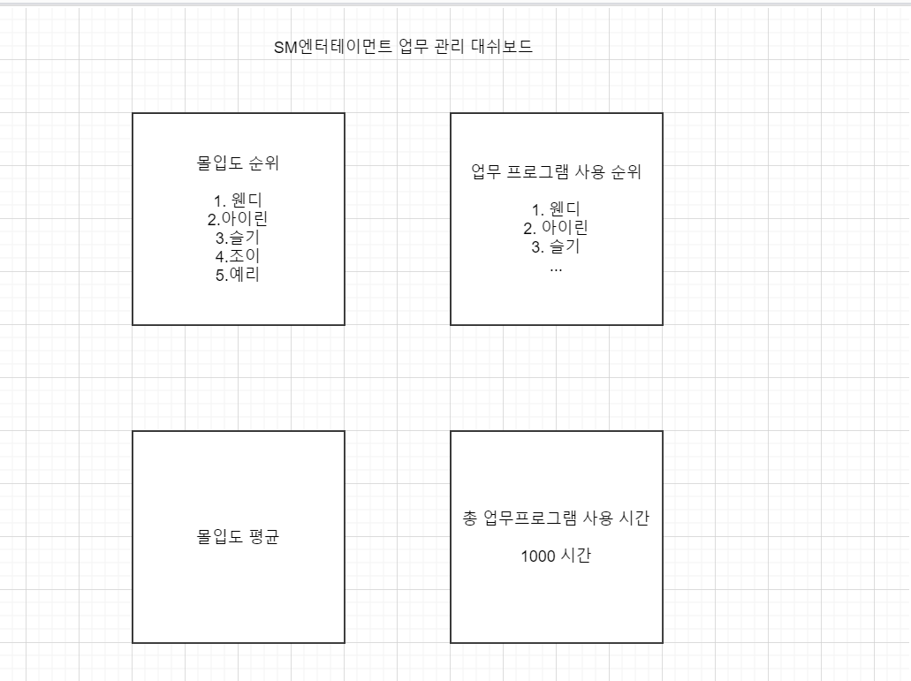

# 큰 그림

## 1. 과제의 목표 및 범위 추가 고민 필요

> 주어진시간 내에 주어진 업무를 충실히 수행하고 있는지 여부 확인이 필요함. <br> -연구개발 주제의 상세 내용중-

주어진 시간 내. => 원격 근무 환경이면 주어진 출근 시간이 있는 건가? 만약 강의에서도 활용이 된다면 너무 범주가 넓다.

원격 근무 환경에서 자유롭게 근무하는 것이라면 sysmon과 winlogbeat와 같은 프로그램이 항상 켜져있어서 로그를 수집해야 됨.

강의처럼 주어진 시간내에 딴짓 안하고 강의를 잘 시청하는가 또는 시험을 잘 보고 있는가에 대한 것은 그 시간만 체크를 하면 됨.

=> 이 두개를 어떻게 할것인가. 범주를 사용자가 설치할때 고를수 있게끔 용도를 정해야 하나...

목표의 대상을 확실히 해야할 것 같다. 

### 만약 퀄리티를 포기하고 범용성을 잡는다면 - 어떨땐 수업시간에 집중잘하는지 판단, 어떨땐 업무 몰입을 측정하는지.

이렇게 된 대쉬보드가 나오지 않을까 생각한다.


의도는 이것이다 수업시간에만 집중하는것을 측정하는 것이면 *로 표시된 차트에서 시간을 조절해 볼 수있는 기능을 활용하고

원격 근무라면 24시간으로 필터링을 다시 바꾸면 됨.

> 기능의 문제점은...

그러나 기능이 너무 제한적이다. 단지 프로그램 실행여부와 실행시간등만 판단이 가능하기 때문에 특히 강의를 잘 듣는지 판단하는 경우라면

켜놓고 자거나 딴짓을 해도 판단할 거리가 없음.... (이것은 명백히 잘못된 것이라고 생각함)

> 또한 구현의 문제점은...

여기서 **빨간색으로 된것만** 배웠던 것을 바탕으로 winlogbeat로 이벤트 캡쳐후 kibana로 구현이 가능하고

나머지는 사용시간을 createdProcess 와 terminatedprocess 이벤트로 계산하던지 다른 agent프로그램으로 새로 로그를 얻어 winlogbeat 뿐만아니라

filebeat로 사용해 elastic cloud로 넘겨주던지 해야됨.

이때 다른 agent프로그램을 찾지 못한다면 위의 두개 이벤트로 시간 차를 계산한 것을 파이썬이나 자바로 프로그래밍을 하여서 

```
[프로그램] use 시간:분:초 
```

형식으로 로그를 남겨서 filebeat로 넘기던지 해야할듯. 그래야 kibana에서 차트로 표현이 가능할 것 같음.

특히 업무 프로그램, 여가 프로그램 사용시간을 정하는 것은 해당 프로그램 시간을 업무프로그램으로 보고 계산하는 방식은 db에서 얻어서 그것을 판단하는 방식으로 해야할듯.

따라서 순수하게 winlogbeat elk로 구현가능한 것은 **빨간색 마크 밖에 없음...**

### 용도를 확실히하고 간다면 - 수업시간에 집중하는 경우로 or 원격시험을 본다고 판단하면?

구체적인 기능을 제공할 수 있음. 그러나 이것은 ELK stack에서 멀어지는 것이 아닐까 생각한다. 왜냐하면

현재 focus 된 프로그램을 관리자에게 넘겨주고 그것이 강의 관련 페이지 인지...를 확인시켜 주면 되고

마이크나 웹캠을 활용하여 그 사람이 전화나 수업을 켜두고 다른 곳에 간지 등을 체크하는 등 로그 수집과는 멀어진다고 판단됨.

굳이 winlog를 따오는 일이 필요없다고 생각 함.

따라서 프로그램 형식이...

마이크, 웹캠으로 딴짓을 판단(머신러닝이나 이런게 더 많이 쓰일것 같음) -> 관리자에게 알림!

포커스 된 프로그램이 유튜브나 게임이라면 -> 관리자에게 알림.

### 용도를 정하면... - 원격 근무 환경에서 회사의 원격근무를 잘하고 있는지 판단.

이때는 winlogbeat + ELK stack을 잘 활용 가능.

범용성을 잡은 개발 방식에서 발전.


여기서 시간 필터링을 빼도 될듯 (물론 이거 정해진 시간에 근무하는 방식이라면 필요할 수도..?)

또한 이 대쉬보드 뿐만아니라 사용자는 회사사람들에 대해 전체적인 대쉬보드도 볼 수 있는 기능을 제공.



전체적인 통합내용을 제공.

서대표님이 제시해준 내용에 대한 answer 
```
-> 부정행위, 이상행위의 차이 이해 - 업무 프로그램을 사용하지 않는다면 전부 이상행위로 판단하기로 함.

-> 몰입도를 수치화해서 표현할지? 아니면 몰입도를 결정하는 요인을 각각 정량적으로만 표현할지?
업무 프로그램을 정의해 그 프로그램에 대한 사용시간을 바탕으로 전체 사용시간에 대한 비율로 나타내는 방식으로 함.

-> 업무를 한다고 하면 어떤 프로세스가 동작하고 있어야 업무를 한다고 할 수 있을까?
회사마다 다르지만 개발회사의 경우엔 관련된 툴 - vscode, vs, 문서프로그램 등 정의를 해둬야할듯. 물론 관리자가 프로그램을 정의할 수 있는 기능을 제공하면 좋을 것같음.

-> 프로그램 사용 통계를 통해 업무에 몰입했다고 볼 수 있는 근거자료가 있을까?
windowlog로 판단하긴 힘들다고 생각함. 프로그래밍을 통해서 해당 프로세스에 대한 focus시간을 계산해 측정한 로그를 계속 남기는 식으로 해야할듯
이것은 나와있는 프로그램이 있다면 쓰지만 없으면 우리가 프로그래밍을 해야한다고 생각함. winlogbeat를 통해서만은 어렵다고 판단함.

-> 최소한 일주일동안 재택을 하는데, 파워포인터도 켜있고, SLACK도 켜있고, 카카오도 켜있고.. 그럼 이 사람은 업무를 몰입해서 했을 까?
위의 질문에 대해 답변한 것 처럼 focus시간을 따로 계산해야할 것 같음.

-> 프로세스 동작을 통해 업무 몰입도를 측정하기 위한 추가적인 근거가 필요해 보임
focus시간으로만으로 힘들수 있음 - 켜두고 밥먹으러 간다면? (이때는 마우스 키보드 입력이 없단는 것을 또 감지하는 것을 해야할듯 3분동안 입력이 없다면 그 시간들은 낭비되는 시간으로 간주 등)

-> 위 제시된 수행되는 프로세스 관점이 아닌, 반대로 접근/접속하지 말아야 하는 Blacklist 방식의 몰입도 계산을 하는 것은 어떨까? (예: 대기업에서는 업무용 PC에서 반드시 필요한 site만 접근하도록 통제하고 있음)
이것에 대해선 여가프로그램에 정의를 하여서 그 시간들을 따로 계산하여 합하는 데쉬보드를 제공해야할듯.
```

여기서 생기는 의문점이라면...

1. winlogbeat를 통해 kibana에 데쉬보드로 보여주는 건 너무 한정적인 것 같음. 위의 데쉬보드를 나타내기 위해 어떤 방법을 써야할까... 확신이 안섬
2. 우선 생각하는 것은 sysmon이나 기존 윈도우 log에서 얻은 ProcessCreated와 ProcessTerminate이벤트로 사용시간을 얻을까 아니면 프로그램 사용시간을 측정할까 - focus된 윈도우를 구분하는 방법에도 생각을 해야함.. 어디까지나 위에 적은 내용들은 내가 스스로 생각한 이론이라 확신이 안섬.
3. 관리자에게 보여주는 데쉬보드를 어떻게 구성할까... Web으로 만들고 kibana는 너무 한정적이라 빨간색표시한 가능한 부분만 kibana로 만든뒤에 iframe을 통해 얻어오고, 나머지는 따로 프로그래밍 해서 보여줘야 하나... 아직 키바나 visualize에 대해 완벽히 알지는 못하지만 공부한 것을 통해 배운것은 빨간것 빼곤 저것들은 불가능이라 판단했음.

## winlogbeat에서 컴퓨터 사용시간 받아오는건...

먼저 엄청 노력해봤지만 실패했다. 컴퓨터 종료, 시작을 알려주는 로그는 있어도 사용종료할 때 컴퓨터 사용 시간을 남기는 로그는 없는 듯 하다.

따라서 시작 - 종료를 계산하는 것을 프로그래밍 해서 따로 로그로 남겨 filebeat로 또 전송을 할지 고민중이다.

이것도 생각을 해야할 것 같다.

## 원격 사용자의 업무 PC Log 수집 방법

기본으로 제공되는 이벤트로그와 sysmon로 수집한 로그를 사용할 예정

컴퓨터 사용시간은 event.id 6006(정상종료), 6005(부팅시 기록되는 이벤트)등 system 이벤트에서 받아옴. - 6005 시간~ 6006시간 (컴퓨터 사용시간) 으로 볼수 있지 않을까?

그리고 프로그램 실행 순위는 ProcessCreate로 event를 filtering 하고 count로 Metric을 만들어주면 될듯. - kibana로 할 수 있을 거같음!


이때 svchost.exe라든가 너무 당연한 프로세스는 필터링을 통해서 없애든지 해야할듯...

프로그램 사용시간은 계산 방법이 두가지임

1. ProcessCreated와 ProcessTerminated 이벤트를 통해 시간차를 계산하여 사용시간 측정
   - 단점은 여러 프로그램 켜놓고 ex: 카톡 켜놓고 코딩하기 - 이런거는 두 시간차가 진짜 사용시간인지 판별이 안됨
2. focus된 시간을 계속 로그로 남겨서 시간을 구하기. - 코딩이나 다른 agent프로그램을 구해서 순수 프로그램 사용시간을 측정하는 방식을 선택해야할듯

2번 방법으로 진행을 하다가 막히면 1번으로 순회하던지 해야할듯... 일단 생각중인 방법은 두가지임

로그 수집은 이 두가지 일듯.
```
-> 기본적으로 Agent를 통해 Log를 수집해야 함
일단 최대한 sysmon과 윈도우 기본 제공되는 eventlog를 winlogbeat를 통해 받아서 최대한 활용하는 방안을 생각해 봄.
그러나 사용시간이 담긴 로그는 따로 없기 때문에 그것을 다른 agent나 프로그래밍을 통해 정해줘야할 것 같음.

-> OS에 따라 Agent 수집 방법 다름 (본 과제는 일단 Window OS를 기준으로 한정. 향후 구현 일정을 보고 iOS, Linux 계열 확정 여부 결정)
이것은 일단 window만 봄...

-> IT 운영조직에서 사용자에게 Agent 배포 방식은 향부 결정 (향후 배포 방식은 다양한 방식 존재하므로..)
배포방식은 아직 자세하게 조사하진 않았지만 NSIS를 통해 설치파일을 구성해볼 예정.
```

## 수집된 로그 저장 관련

-> 어떤 Log를 수집해야 하는가? (부정행위, 이상행위 관련 log)
-> 필요한 / 불필요한 로그는 어떻게 정의할 수 있을까? (Log 유형 및 활용방안이 사전에 정의되어야 함)
-> 수집된 로그 및 활용에 따라 '사용자의 부정행위' 외에 보안(Security)에 해당되는 'PC 이상행위' 모니터링 범위까지 더 넓게 응용하여 활용 가능함
(예: 악성코드 감염으로 인한 프로세스 생성, 프로세스 접근, RDP를 통한 외부->내부 접속 시도, Log 조작시도, 보안 솔루션 우회 시도, 프로세스 shut down 시도, in/outbound 트래픽 증가 등)

sysmon template를 찾을 필요성이 있을까.... 고민