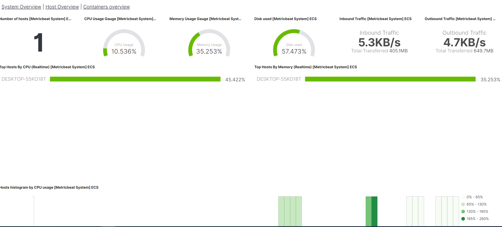
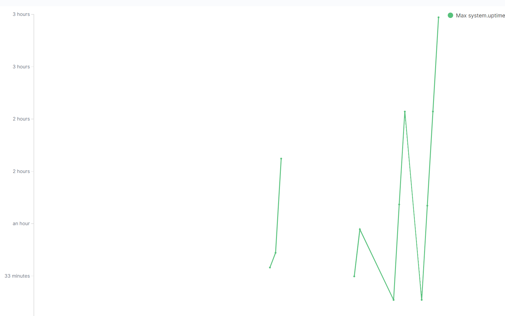
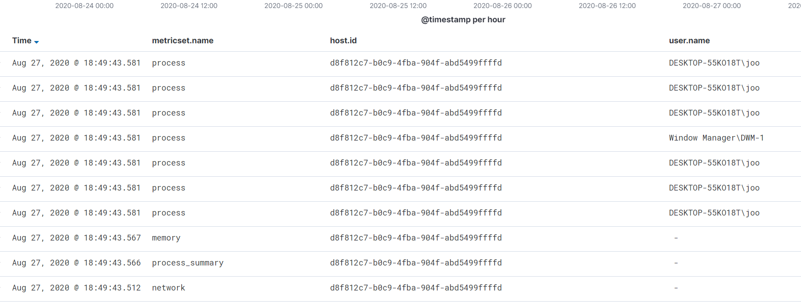
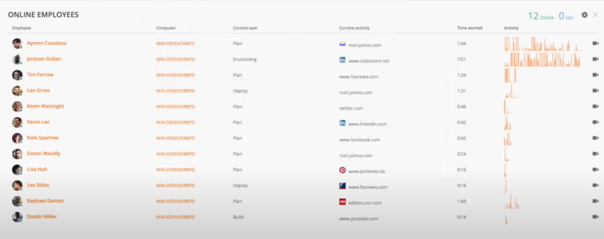

# 컴퓨터 사용시간 띄우기

키바나 보드에 컴퓨터 사용시간 띄우는 것이 목표

## 컴퓨터 사용시간을 띄우면...

관리자가 제일 기본이 되는 정보인 컴퓨터 사용량을 확인 할 수 있음.

일단 1명의 컴퓨터 사용량이 어느정도인지 알 수 있는 데쉬보드를 만들어볼 예정.

## 어떻게 접근할 것인가...

먼저 생각해볼 내용은 과연 이벤트 winlog만으로 그것을 볼 수 있는 가 이다.

컴퓨터 부팅 완료시간, 윈도우 종료시간 이것은 log로 확인이 가능하지만 그 시간 차를 계산해서 kibana에 띄우는 것은 매우 어려웠고 검색을 해봐도 나오질 않았다.

따라서 검색해본 결과 시스템을 모니터링 해주는 metricbeat를 사용해보는 것을 1차적으로 시도해볼 예정이다.

## Metric beat 실습

일단 공식홈페이지와 블로그를 참조해서 단순히 실행시키고 확인한 데쉬보드이다. - 데쉬보드는 기본으로 제공되서 들어가는듯

그리고 확인한 것이 uptime field이다. 이것 잘 조합하면 뭔가 kibana에서 할 수 있을 것 같다...

그래서 결국 축적된 시간을 띄우는 것 까지느 성공 했다 그러나 이것도 진짜 컴퓨터 실행시간이라고 할수 없다

그러다가 검색하다 알게된 JSON으로 input을 계산하거나 할수 있다는 것을 알았다 이것을 조금더 진행해볼 예정이다.

## 8월 26일

json의 한계를 느끼다가 apm이란 것을 알게되었다. 이것에 대해서 추가적인 공부를 하는 중이다.

[apm사용해보기](https://saramin.github.io/2020-03-24-elastic-apm-1/)

## 8월 27일

[teramind](https://www.youtube.com/watch?time_continue=57&v=Gc021ChUXUo&feature=emb_logo)

이것보고 먼저 통합 데쉬보드 짜보는 것 부터 해봤음 - metricbeat로 충분히 할 수 있을 가능성을 봄.

시도해서 성공한 것 Time worked 띄운것. 컴퓨터 정보와 - 그러나 이게... 보기엔 너무 불편.

길을 바꿈!

사용자 현황판을 먼저 짜보자 그러기 위해선...

1. 사람이름과 컴퓨터이름을 매치시키는 테이블이 필요.

