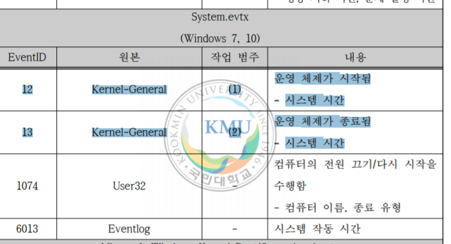
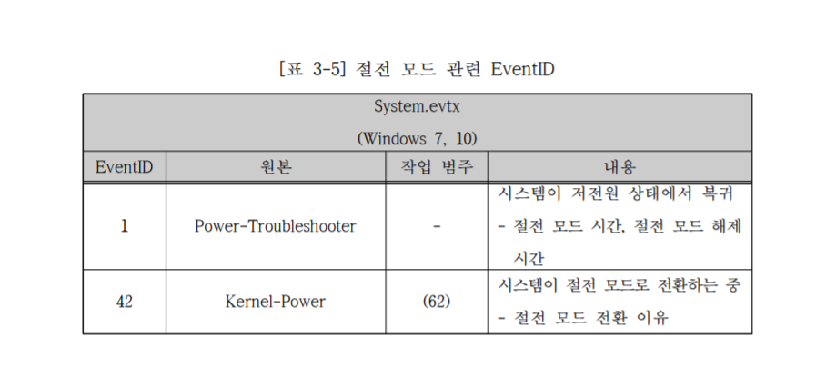

# Microsoft 이벤트 정보 분석

**조사전 유용한 링크**
[윈도우 서비스 목록](https://ss64.com/nt/syntax-services.html)
[윈도우 이벤트 로그(EVTX) 분석 및 포렌식 활용방안](http://www.riss.kr/search/detail/DetailView.do?p_mat_type=be54d9b8bc7cdb09&control_no=710f97de0f7e4ed9ffe0bdc3ef48d419&outLink=K)

## 개요

이벤트로그는 윈도우 운영체제의 시스템 로그 관리 기법. XML기반의 EVTX파일로 관리가됨.

10가지 부정행위에 대해 분석

- 시스템 시작/종료
- 절전 모드
- 네트워크 연결/해제
- 공유폴더
- 원격 데스크톰 연결/해제
- 외장저장장치 연결/해제
- 응용 프로그램 설치
- 문서 출력
- 이벤트로그 삭제
- 시스템 시간 변경

5가지 악성 코드 관련 행위 분석

- 파일 조작
- 레지스트리 조작
- DNS질의
- 프로세스 생성/종료
- 윈도우 서비스 추가

이벤트 ID와 관련 EVTX파일, 또 이벤트 메세지 분석 방법을 제시한 논문임.

## 이벤트 로그 EVTX

시스템, 애플리케이션 작동 상태 및 사용자의 행위에 따라 발생하는 모든 동작에 대한 기록.

메타데이터와 메세지를 확인 할 수 있는데

메타데이터는...

- Channel: 이벤트 로그 파일 이름
- Provider:서비스 공급자 이름
- Task : 원본에 의한 이벤트 분류
- Level: 이벤트의 심각성(위험,오류 경고,정보 등)
- TimeCreated: 로그가 기록된 날짜
- Keywords: 이벤트 분류
- EventRecordID: 이벤트 식별자
- Version: System or Customer
- Computer: PC name
- Opcode: 구성 요소가 수행하는 작업 범주 식별

EVTX파일은 ‘%SystemRoot%\System32\winevt\Logs\’ 경로에 저장이 된다.


아직 구조가 이해가 된건 아니지만 읽어봄

chunk에 대해 이해하기 위해 [링크](https://gflow-security.tistory.com/entry/Windows-Artifact6-EventLog)
를 참조했다.

저것은 메모리 개념에서 생각하면 되는듯 하다. (http packet보내듯이 그런느낌으로?)

그러나 요즘 gui나 xml파일로 추출을 할 수 있기 때문에 이벤트 파일 자체를 분석하는 방법은 읽어봣는데 우리에게 도움되는 내용은 아닌듯 하다...

## 시스템/시작 종료



두개의 이벤트 아이디를 판별 해야할듯 - System 범주는 winlogbeat으로 통과시키니 유용한 정보.

감지 해야할 아이디 두개임. 현재 컴퓨터가 켜져있는가 => 근무할 가능성 on
꺼져있음 => 근무 x

이것을 kibana로 나타내는게 엄청 힘듬 - 종료 시작시간을 그 사이시간을 측정한 로그가 없기 때문에 그것을 따로 만들어줘야됨

이것을 프로그래밍 해서 로그화 하여 filebeat로 넘겨줄지는 의문이다. 

그리고 두번째 문제는 mapping 문제였다. 6013 이벤트가 00시에 사용 시간을 남긴다고 해서 봣는데 param5가 윈도우 초를 남김 근대 보니까 string type으로 되어있어서 kibana에서 덧샘이 안됨 ㅠㅜ

물론 이게 6013이 진짜 사용시간인지는 의문이 들지만 만약 맞다해도 실시간으로 반영이 안되고 일정 시간마다 남기는 로그라고 해서 쓰면 좋은 로그는 아닌것 같음.

## 절전모드



직접 이벤트로그를 봐서 분석해보니 event.id 1은 절전모드 이유만 나와있고 42가 절전모드를 얼마나 했는지 알 수 있다.

따라서 총 컴퓨터 사용시간은 (시스템 종료시간 - 시스템 사용 시간) - (절전시간) 으로 계산 할 수가 있다.

## 네트워크 부분

이 부분은 프로젝트와 관련이 없다고 생각했다. 일단 정보도 한정적이다. 네트워크 이름에 대해서 나오지만 대부분 식별 중.. 으로 뜨기 때문에 정확한 정보를 얻기 힘들었다.

## 공유폴더와 외부 기기 연결와 RDP && 문서출력

기업에서 사용할 제품이라면 기밀 유출을 파악할 수 있으면 좋긴하다. 그러나 내용이 너무 어렵기도 하고 우선적이라 생각되지 않는다.

## event id 17

이것은 실행한 프로그램의 응용프로그램 설치 경로가 나온다는데 어떻게 실행한 프로그램이 반영되는 건지 모르겠음...

## 이벤트 로그 삭제 && 시스템 시간 변경

1102, 104 는 부정행위에 대한 판별로 이벤트로그를 감지하면 좋을 것 같다. 시스템 시간도 마찬가지 (물론 맨먼저 보여주는 것부터 해결하고 부정행위 감지를 해야하는게 맞는것같음.)

## 서비스 관련

sysmon으로 탐지가 가능하다!

```
시나리오

1. 컴퓨터를 켰다.
2. 활동감지
  - 인터넷 서핑 (사이트에 대한 정보도 필요)
  - 프로그램 감지 - 키고 종료된 시간과 활성화 된시간
3. 컴퓨터 절전 or 종료
```

## 필터링 할 로그 카테고리

- 시스템(컴퓨터자체 활동 - )

## 5379

### 실행 프로세스

대부분 Process 가 lsass이고 검색결과

> 로컬 보안 인증 하위 시스템 서비스는 시스템의 보안 정책을 강화를 위한 윈도우의 프로세스이다. 이것은 윈도우 컴퓨터나 서버에 접속하는 유저들의 로그인을 검사하며, 비밀번호 변경을 관리하고, 액세스 토큰을 생성한다. 또한 Windows Security Log를 작성한다. 위키백과

라는 정보를 얻음.

보안에 관한 정보는 이것이 System32폴더에서 실행중이 아니라면 악성코드일 가능성이 무지 높다고 한다.
